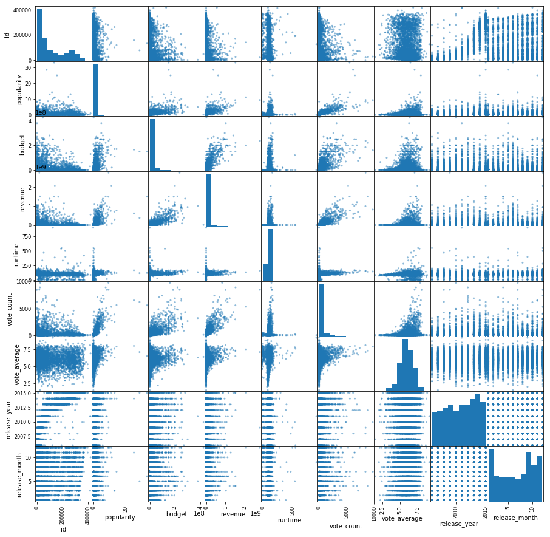

# 项目：TMDb电影市场调查数据集
## 目录
<ul>
<li><a href="#intro">简介</a></li>
<li><a href="#wrangling">数据整理</a></li>
<li><a href="#eda">探索性数据分析</a></li>
<li><a href="#conclusions">结论</a></li>
</ul>

<a id='intro'></a>
## 简介


> 在本份报告中，我选取的数据集是TMDb电影数据。本数据集中包含10866条电影信息，划分为21个不同属性。为了是数据集简洁同时与所要分析的问题更加相关，我在数据整理与清洗过程中去掉了8个无关列，它们是：'imdb_id', 'cast', 'homepage', 'tagline', 'overview', 'production_ companies', 'budget_adj', 'revenue_adj'，之后我进行了过滤、丢空、去重的操作。为了便于分析，我对release_date列进行了整理，提取出上映的月份信息。对keywords和genres列采取了简化处理，仅保留首个词语进行分析。然后把数据集保存为tmdb-movies_cleaning.csv,进行分析和可视化。
> 这份报告中，针对这个数据集将讨论三个问题：  
  
  >&emsp;&emsp;1.10年来，哪种类型的电影最受欢迎？哪些最受冷落？分别统计出前三名。  
  
  >&emsp;&emsp;2.哪一个月份上映的电影数量最多？该月份的票房收入占比怎么样？  
  
  >&emsp;&emsp;3.票房与受欢迎程度的关系？影评得分与票房收入的关系？还有其他影响因素吗?  
  


```python
# 导入清理后的数据文件
import pandas as pd
import matplotlib.pyplot as plt
%matplotlib inline
df = pd.read_csv('tmdb-movies_cleaning.csv')
```


```python
# 查看数据集特征
df.head(5)
```


<div>
<style scoped>
    .dataframe tbody tr th:only-of-type {
        vertical-align: middle;
    }

    .dataframe tbody tr th {
        vertical-align: top;
    }

    .dataframe thead th {
        text-align: right;
    }
</style>
<table border="1" class="dataframe">
  <thead>
    <tr style="text-align: right;">
      <th></th>
      <th>id</th>
      <th>popularity</th>
      <th>budget</th>
      <th>revenue</th>
      <th>original_title</th>
      <th>director</th>
      <th>keywords</th>
      <th>runtime</th>
      <th>genres</th>
      <th>vote_count</th>
      <th>vote_average</th>
      <th>release_year</th>
      <th>release_month</th>
    </tr>
  </thead>
  <tbody>
    <tr>
      <th>0</th>
      <td>135397</td>
      <td>32.985763</td>
      <td>150000000</td>
      <td>1513528810</td>
      <td>Jurassic World</td>
      <td>Colin Trevorrow</td>
      <td>monster</td>
      <td>124</td>
      <td>Action</td>
      <td>5562</td>
      <td>6.5</td>
      <td>2015</td>
      <td>6</td>
    </tr>
    <tr>
      <th>1</th>
      <td>76341</td>
      <td>28.419936</td>
      <td>150000000</td>
      <td>378436354</td>
      <td>Mad Max: Fury Road</td>
      <td>George Miller</td>
      <td>future</td>
      <td>120</td>
      <td>Action</td>
      <td>6185</td>
      <td>7.1</td>
      <td>2015</td>
      <td>5</td>
    </tr>
    <tr>
      <th>2</th>
      <td>262500</td>
      <td>13.112507</td>
      <td>110000000</td>
      <td>295238201</td>
      <td>Insurgent</td>
      <td>Robert Schwentke</td>
      <td>based on novel</td>
      <td>119</td>
      <td>Adventure</td>
      <td>2480</td>
      <td>6.3</td>
      <td>2015</td>
      <td>3</td>
    </tr>
    <tr>
      <th>3</th>
      <td>140607</td>
      <td>11.173104</td>
      <td>200000000</td>
      <td>2068178225</td>
      <td>Star Wars: The Force Awakens</td>
      <td>J.J. Abrams</td>
      <td>android</td>
      <td>136</td>
      <td>Action</td>
      <td>5292</td>
      <td>7.5</td>
      <td>2015</td>
      <td>12</td>
    </tr>
    <tr>
      <th>4</th>
      <td>168259</td>
      <td>9.335014</td>
      <td>190000000</td>
      <td>1506249360</td>
      <td>Furious 7</td>
      <td>James Wan</td>
      <td>car race</td>
      <td>137</td>
      <td>Action</td>
      <td>2947</td>
      <td>7.3</td>
      <td>2015</td>
      <td>4</td>
    </tr>
  </tbody>
</table>
</div>


```python
df.info()
```

    <class 'pandas.core.frame.DataFrame'>
    RangeIndex: 4398 entries, 0 to 4397
    Data columns (total 13 columns):
    id                4398 non-null int64
    popularity        4398 non-null float64
    budget            4398 non-null int64
    revenue           4398 non-null int64
    original_title    4398 non-null object
    director          4398 non-null object
    keywords          4398 non-null object
    runtime           4398 non-null int64
    genres            4398 non-null object
    vote_count        4398 non-null int64
    vote_average      4398 non-null float64
    release_year      4398 non-null int64
    release_month     4398 non-null int64
    dtypes: float64(2), int64(7), object(4)
    memory usage: 446.8+ KB
    

### 数据整理

步骤见副本：TMDb_data_cleaning.html

### 数据清理

步骤见副本：TMDb_data_cleaning.html

# <a id='eda'></a>
## 探索性数据分析

> **提示**：整理和清理数据之后，现在可以进行探索。计算统计值，创建视图，解决你在简介段提出的研究问题。建议采用系统化方法。一次探索一个变量，然后探索变量之间的关系。

### 研究问题 1: 10年来，哪种类型的电影最受欢迎？哪些最受冷落？分别统计出前三名。


```python
# 统计2006年-2015年间每类电影平均受欢迎程度
# 绘制10年每类电影受欢迎程度平均值的图柱
df.groupby('genres')['popularity'].mean().sort_values(ascending = False).plot(kind = 'bar',grid = True);
# 标题和标签
plt.title('Average Popularity Of Different Genres In Decade');
plt.ylabel('average popularity');
```


说明：上图为不同类型的电影在2006年至2015年10年间的平均受欢迎程度的统计，x轴为类型，y轴为平均受欢迎程度，从高到底依次排列。由图中可知，最受欢迎的依次为Western,Adventure以及Science Fiction,最不受欢迎的依次为Foreign,Documentary和TV Movie。

### 研究问题 2：哪一个月份上映的电影数量最多？该月份的票房收入占比怎么样？


```python
# 按月份统计上映的电影数量和录得票房收入
quantity_month = df['release_month'].value_counts().sort_index(ascending=True)
revenue_month = df.groupby('release_month')['revenue'].sum()
```


```python
# 绘制折线图，对比显示按月统计的上映电影数量和电影市场票房收入的变化趋势
fig, ax1 = plt.subplots() 
# 创建副y轴
ax2 = ax1.twinx()
pos_z = [1,2,3,4,5,6,7,8,9,10,11,12]
# 绘制折线图
plot1, = ax1.plot(pos_z, quantity_month, linewidth = 2, color = 'b')  # 这个 ','一定要有，不然legend会报错
plot2, = ax2.plot(pos_z, revenue_month, linewidth = 2, color = 'r')
# 标签、图例及设置坐标范围
ax1.set_xlabel('month', fontsize = 12)  
ax1.set_ylabel('quantity', fontsize = 12)
ax2.set_ylabel('revenue', fontsize = 12)
ax1.set_xlim([1, 12]) 
ax1.set_ylim(0, max(num_permonth))
ax2.set_ylim([0, max(sum_revenue)])
plt.title('Quantity And Revenue Trend In Year',fontsize = 14)
plt.legend([plot1,plot2],('quantity','revenue'),loc = 8)
plt.show()
```


说明：上图为一年中电影的上映数量和票房的趋势图，数据范围为2006年至2015年10年间的平均统计数据（按月）。蓝色线条代表上映数量，我们发现峰值大约出现在9月份。红色线条代表每月总票房，发现峰值出现在6月份。电影的上映数量与每月票房峰值不重合。说明不是电影扎堆上映就能带来票房的火爆，二者没有直接相关性。


```python
# 计算9月份上映的电影的票房占比
# 首先计算票房总额
all_rev = df['revenue'].sum()
print(all_rev)
```

    219650938060
    


```python
# 计算9月份票房
df_temp01 = df.query('release_month == 9')
rev_9 = df_temp01['revenue'].sum()
print(rev_9)
print(rev_9/all_rev)
```

    14601212093
    0.0664746175089
    


```python
# 计算6月份票房
df_temp01 = df.query('release_month == 6')
rev_6 = df_temp01['revenue'].sum()
print(rev_6)
print(rev_6/all_rev)
```

    32765424581
    0.149170428637
    


```python
# 计算1月份票房
df_temp01 = df.query('release_month == 1')
rev_1 = df_temp01['revenue'].sum()
print(rev_1)
print(rev_1/all_rev)
```

    8085719966
    0.0368116796469
    


```python
# 绘制每个月的票房占比饼图
df.groupby('release_month')['revenue'].sum().plot(kind = 'pie');
```


说明：上图绘制了每个月的票房占比饼图，数据来自2005年至2016年10年的平均统计数据。我们发现，票房占比最高的为6月份，达到14.9%；占比最低的为1月份，只占3.7%。而电影档期集中的9月份的票房占比则只有6.6%，未达到平均水平（8.3%）。

### 研究问题 3：票房与受欢迎程度的关系？影评得分与票房收入的关系？还有其他影响因素吗？


```python
# 绘制票房与受欢迎程度的散点图，票房取大于5千万的样本，欢迎程度取小于15的样本
df_temp02 = df.query('revenue > 50000000').query('popularity < 15')
df_temp02.plot(y = 'popularity', x = 'revenue', kind = 'scatter', color = 'orange', grid = True);
plt.title('Revenue VS Popularity');
```


说明：上图为说明票房与受欢迎程度关系的散点图，在不影响客观性的前提下，我们截取票房大于5千万和受欢迎程度小于15的样本进行统计。x轴为票房，y轴为受欢迎程度，从图中我们发现随着受欢迎程度的提高，票房也在升高，二者呈现了明显的正相关关系。


```python
# 绘制票房与平均影评得分的散点图
df_temp02.plot(y = 'vote_average', x = 'revenue', kind = 'scatter', color = 'orange', grid = True);
plt.title('Revenue VS Vote_average');
```


说明：上图为说明票房与平均影评得分关系的散点图。x轴为票房，y轴为平均影评得分，从图中我们发现随着平均影评得分的提高，票房也在升高，二者呈现了明显的正相关关系。


```python
# 绘制所有因素间的散点图
pd.plotting.scatter_matrix(df,figsize = (15, 15));
```





说明：上图为所有因素间关系的散点图矩阵。通过观察x轴”票房“这一列，我们可以发现除了与受欢迎程度和平均影评得分呈现正相关关系外，票房还与影评数量（vote_count）以及影片预算（budget）呈现正相关关系。说明影评数量越多，票房越火爆，影片制作预算越高，取得的票房成绩也越好。

<a id='conclusions'></a>
## 结论


> **1.10年来，哪种类型的电影最受欢迎？哪些最受冷落？分别统计出前三名。**  
经过统计分析，10年来最受欢迎的电影类型是：Western,Adventure和Science Fiction,而Foreign、Documentary和TV Movie倍受冷落，排名倒数。

> **2.哪一个月份上映的电影数量最多？该月份的票房收入占比怎么样？**  
9月份上映的影片数量最多，累计达到600部以上。但是通过和票房收入对比，发现反而是6月份的票房收入达到峰值，占比达到14.9%，反观排片上映最为火爆的9月份票房占比仅有6.6%。  

> **3.票房与受欢迎程度的关系？影评得分与票房收入的关系？还有其他影响因素吗?**  
票房与受欢迎程度呈现正相关关系，即受欢迎程度越高，票房成绩也越好。同时票房与影评得分也呈现正相关关系，即影评平均评分越高，票房成绩也越好。观察所有因素散点图还可以发现，票房与影评数量、影片预算均呈现正相关关系。  
  
> **4.关于在分析中存在的限制的讨论。**  
原数据集的样本为10866条数据，包括1966年至2015年的数据。在这里我设置了一个前提，是只统计近10年的电影数据，所以我截取了2006年以后的电影数据得到5481条数据，分析10年来的电影市场基于这5481条数据不会存在偏差。之后进行了丢空处理，剩下4399条数据，超过了原10年数据总体的80%，应该能够代表整体。
但是由于我对genres进行了简单化处理，暨仅提取第一个词语作为该部电影的类型属性，这有可能对不同类型电影受欢迎程度的分析造成一定的偏差，最好的方式还是应该将所有词语拆分并归类进行统计，这也是进一步细化研究的方向。


```python
·
```
