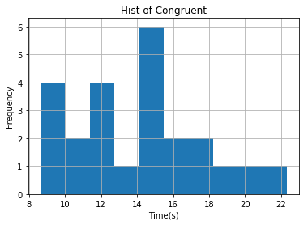

### 统计学：检验心理学现象

背景信息

在一个Stroop （斯特鲁普）任务中，参与者得到了一列文字，每个文字都用一种油墨颜色展示。参与者的任务是将文字的打印颜色大声说出来。这项任务有两个条件：一致文字条件，和不一致文字条件。在一致文字条件中，显示的文字是与它们的打印颜色匹配的颜色词，如“红色”、“蓝色”。在不一致文字条件中，显示的文字是与它们的打印颜色不匹配的颜色词，如“紫色”、“橙色”。在每个情况中，我们将计量说出同等大小的列表中的墨色名称的时间。每位参与者必须全部完成并记录每种条件下使用的时间。

调查问题


(1) 我们的自变量是什么？因变量是什么？

**答案：自变量：文字条件；因变量：说出同等大小的列表中墨色名称的时间。**

(2) 此任务的适当假设集是什么？你需要以文字和数学符号方式对假设集中的零假设和对立假设加以说明，并对数学符号进行定义。你想执行什么类型的统计检验？为你的选择提供正当理由（比如，为何该实验满足你所选统计检验的前置条件）。

**答案：零假设为完成一致任务的时间均值等于完成非一致任务的时间均值。对立假设为完成一致任务的时间均值不等于完成非一致任务的时间均值。二者均为总体时间均值。** 
  
$$H_0: \mu_{con} - \mu_{incon} = 0$$  
$$H_1: \mu_{con} - \mu_{incon} \neq 0 $$  
  
**执行相依样本双尾t检验，样本满足的前提条件：1.根据统计经验，两样本来自的总体分别满足正态分布；2.可由样本方差估计总体方差。3.两总体方差相等。**

备注：T-test Assumptions:
1.X and Y should be random samples from two independent populations.(相依样本不需要))
2.Population are approximately normal;  
3.Sample data can estimate population variances;  
4.Population variances are roughly equal.(独立样本需计算对比，相依样本不需要计算)


(3) 报告关于此数据集的一些描述性统计。包含至少一个集中趋势测量和至少一个变异测量。


```python
# 在这里执行你的分析
import pandas as pd
import matplotlib.pyplot as plt
% matplotlib inline
df = pd.read_csv('stroopdata.csv')
df.head(10)
```


<div>
<style>
    .dataframe thead tr:only-child th {
        text-align: right;
    }

    .dataframe thead th {
        text-align: left;
    }

    .dataframe tbody tr th {
        vertical-align: top;
    }
</style>
<table border="1" class="dataframe">
  <thead>
    <tr style="text-align: right;">
      <th></th>
      <th>Congruent</th>
      <th>Incongruent</th>
    </tr>
  </thead>
  <tbody>
    <tr>
      <th>0</th>
      <td>12.079</td>
      <td>19.278</td>
    </tr>
    <tr>
      <th>1</th>
      <td>16.791</td>
      <td>18.741</td>
    </tr>
    <tr>
      <th>2</th>
      <td>9.564</td>
      <td>21.214</td>
    </tr>
    <tr>
      <th>3</th>
      <td>8.630</td>
      <td>15.687</td>
    </tr>
    <tr>
      <th>4</th>
      <td>14.669</td>
      <td>22.803</td>
    </tr>
    <tr>
      <th>5</th>
      <td>12.238</td>
      <td>20.878</td>
    </tr>
    <tr>
      <th>6</th>
      <td>14.692</td>
      <td>24.572</td>
    </tr>
    <tr>
      <th>7</th>
      <td>8.987</td>
      <td>17.394</td>
    </tr>
    <tr>
      <th>8</th>
      <td>9.401</td>
      <td>20.762</td>
    </tr>
    <tr>
      <th>9</th>
      <td>14.480</td>
      <td>26.282</td>
    </tr>
  </tbody>
</table>
</div>


```python
# 查看数据维度
df.shape
```


    (24, 2)


```python
# 查看数据完整性
df.info()
```

    <class 'pandas.core.frame.DataFrame'>
    RangeIndex: 24 entries, 0 to 23
    Data columns (total 2 columns):
    Congruent      24 non-null float64
    Incongruent    24 non-null float64
    dtypes: float64(2)
    memory usage: 464.0 bytes
    


```python
# 查看数据统计信息
df.describe()
```


<div>
<style>
    .dataframe thead tr:only-child th {
        text-align: right;
    }

    .dataframe thead th {
        text-align: left;
    }

    .dataframe tbody tr th {
        vertical-align: top;
    }
</style>
<table border="1" class="dataframe">
  <thead>
    <tr style="text-align: right;">
      <th></th>
      <th>Congruent</th>
      <th>Incongruent</th>
    </tr>
  </thead>
  <tbody>
    <tr>
      <th>count</th>
      <td>24.000000</td>
      <td>24.000000</td>
    </tr>
    <tr>
      <th>mean</th>
      <td>14.051125</td>
      <td>22.015917</td>
    </tr>
    <tr>
      <th>std</th>
      <td>3.559358</td>
      <td>4.797057</td>
    </tr>
    <tr>
      <th>min</th>
      <td>8.630000</td>
      <td>15.687000</td>
    </tr>
    <tr>
      <th>25%</th>
      <td>11.895250</td>
      <td>18.716750</td>
    </tr>
    <tr>
      <th>50%</th>
      <td>14.356500</td>
      <td>21.017500</td>
    </tr>
    <tr>
      <th>75%</th>
      <td>16.200750</td>
      <td>24.051500</td>
    </tr>
    <tr>
      <th>max</th>
      <td>22.328000</td>
      <td>35.255000</td>
    </tr>
  </tbody>
</table>
</div>


**答案：关于此数据集的一些描述性统计，一致性组完成的平均时间为：14.05s，中位数为：14.35s，值域为：[8.63, 22.32]，标准差为3.559s;非一致性组完成的平均时间为：22.02s，中位数为：21.02s，值域为：[15.68, 35.26]，标准差为4.797s。**

(4) 提供显示样本数据分布的一个或两个可视化。用一两句话说明你从图中观察到的结果。


```python
# 分别创建一致性组和非一致性组的直方图
df['Congruent'].hist();
plt.title("Hist of Congruent");
plt.xlabel("Time(s)");
plt.ylabel("Frequency");
```





```python
df['Incongruent'].hist();
plt.title("Hist of Inongruent");
plt.xlabel("Time(s)");
plt.ylabel("Frequency");
```


**答案：从图中观察到，一致性组的峰值出现在15s左右，非一致性组的峰值出现在20s左右，同时两个图形的样子不似正态分布。**

(5) 现在，执行统计测试并报告你的结果。你的置信水平和关键统计值是多少？你是否成功拒绝零假设？对试验任务得出一个结论。结果是否与你的期望一致？


```python
# 在这里执行统计检验,两组之间相互独立
from scipy.stats import ttest_rel  
X = df['Congruent']
y = df['Incongruent']
t_score,p_value = ttest_rel(X,y)  
print("t_score:%.3f, p_value:%.8f"%(t_score,p_value))
```

    t_score:-8.021, p_value:0.00000004
    

**答案：显著性水平Alpha取5%，自由度为23，通过查询t值表，得到该双尾检验的t临界值为±2.069。根据t检验结果，我们选取0.05的显著性水平进行分析，我们发现p值远远小于0.05，所以我们有理由成功拒绝零假设。结果为一致性组的朗读时间均值不等于非一致性组的时间均值。与我的期望一致。**
