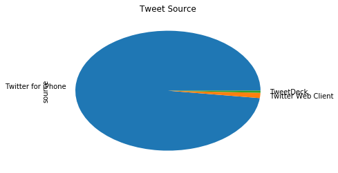

## 项目名称：WeRateDogs推特档案数据集清洗与分析

## 一 数据整理

### 收集


```python
import pandas as pd
import numpy as np
import requests 
import json
import matplotlib.pyplot as plt
% matplotlib inline
```


```python
# 下载image-predictions.tsv文件
url = 'https://raw.githubusercontent.com/udacity/new-dand-advanced-china/master/%E6%95%B0%E6%8D%AE%E6%B8%85%E6%B4%97/WeRateDogs%E9%A1%B9%E7%9B%AE/image-predictions.tsv'
response = requests.get(url)
file_name = 'image_predictions.tsv'
with open(file_name, 'wb') as file_temp:
    file_temp.write(response.content)
```


```python
# 导入pd DataFrame
image_pre = pd.read_csv('image_predictions.tsv', sep='\t')
image_pre
```


<div>
<style scoped>
    .dataframe tbody tr th:only-of-type {
        vertical-align: middle;
    }

    .dataframe tbody tr th {
        vertical-align: top;
    }

    .dataframe thead th {
        text-align: right;
    }
</style>
<table border="1" class="dataframe">
  <thead>
    <tr style="text-align: right;">
      <th></th>
      <th>tweet_id</th>
      <th>jpg_url</th>
      <th>img_num</th>
      <th>p1</th>
      <th>p1_conf</th>
      <th>p1_dog</th>
      <th>p2</th>
      <th>p2_conf</th>
      <th>p2_dog</th>
      <th>p3</th>
      <th>p3_conf</th>
      <th>p3_dog</th>
    </tr>
  </thead>
  <tbody>
    <tr>
      <th>0</th>
      <td>666020888022790149</td>
      <td>https://pbs.twimg.com/media/CT4udn0WwAA0aMy.jpg</td>
      <td>1</td>
      <td>Welsh_springer_spaniel</td>
      <td>0.465074</td>
      <td>True</td>
      <td>collie</td>
      <td>0.156665</td>
      <td>True</td>
      <td>Shetland_sheepdog</td>
      <td>0.061428</td>
      <td>True</td>
    </tr>
    <tr>
      <th>1</th>
      <td>666029285002620928</td>
      <td>https://pbs.twimg.com/media/CT42GRgUYAA5iDo.jpg</td>
      <td>1</td>
      <td>redbone</td>
      <td>0.506826</td>
      <td>True</td>
      <td>miniature_pinscher</td>
      <td>0.074192</td>
      <td>True</td>
      <td>Rhodesian_ridgeback</td>
      <td>0.072010</td>
      <td>True</td>
    </tr>
    <tr>
      <th>2</th>
      <td>666033412701032449</td>
      <td>https://pbs.twimg.com/media/CT4521TWwAEvMyu.jpg</td>
      <td>1</td>
      <td>German_shepherd</td>
      <td>0.596461</td>
      <td>True</td>
      <td>malinois</td>
      <td>0.138584</td>
      <td>True</td>
      <td>bloodhound</td>
      <td>0.116197</td>
      <td>True</td>
    </tr>
    <tr>
      <th>3</th>
      <td>666044226329800704</td>
      <td>https://pbs.twimg.com/media/CT5Dr8HUEAA-lEu.jpg</td>
      <td>1</td>
      <td>Rhodesian_ridgeback</td>
      <td>0.408143</td>
      <td>True</td>
      <td>redbone</td>
      <td>0.360687</td>
      <td>True</td>
      <td>miniature_pinscher</td>
      <td>0.222752</td>
      <td>True</td>
    </tr>
    <tr>
      <th>4</th>
      <td>666049248165822465</td>
      <td>https://pbs.twimg.com/media/CT5IQmsXIAAKY4A.jpg</td>
      <td>1</td>
      <td>miniature_pinscher</td>
      <td>0.560311</td>
      <td>True</td>
      <td>Rottweiler</td>
      <td>0.243682</td>
      <td>True</td>
      <td>Doberman</td>
      <td>0.154629</td>
      <td>True</td>
    </tr>
    <tr>
      <th>5</th>
      <td>666050758794694657</td>
      <td>https://pbs.twimg.com/media/CT5Jof1WUAEuVxN.jpg</td>
      <td>1</td>
      <td>Bernese_mountain_dog</td>
      <td>0.651137</td>
      <td>True</td>
      <td>English_springer</td>
      <td>0.263788</td>
      <td>True</td>
      <td>Greater_Swiss_Mountain_dog</td>
      <td>0.016199</td>
      <td>True</td>
    </tr>
    <tr>
      <th>6</th>
      <td>666051853826850816</td>
      <td>https://pbs.twimg.com/media/CT5KoJ1WoAAJash.jpg</td>
      <td>1</td>
      <td>box_turtle</td>
      <td>0.933012</td>
      <td>False</td>
      <td>mud_turtle</td>
      <td>0.045885</td>
      <td>False</td>
      <td>terrapin</td>
      <td>0.017885</td>
      <td>False</td>
    </tr>
    <tr>
      <th>7</th>
      <td>666055525042405380</td>
      <td>https://pbs.twimg.com/media/CT5N9tpXIAAifs1.jpg</td>
      <td>1</td>
      <td>chow</td>
      <td>0.692517</td>
      <td>True</td>
      <td>Tibetan_mastiff</td>
      <td>0.058279</td>
      <td>True</td>
      <td>fur_coat</td>
      <td>0.054449</td>
      <td>False</td>
    </tr>
    <tr>
      <th>8</th>
      <td>666057090499244032</td>
      <td>https://pbs.twimg.com/media/CT5PY90WoAAQGLo.jpg</td>
      <td>1</td>
      <td>shopping_cart</td>
      <td>0.962465</td>
      <td>False</td>
      <td>shopping_basket</td>
      <td>0.014594</td>
      <td>False</td>
      <td>golden_retriever</td>
      <td>0.007959</td>
      <td>True</td>
    </tr>
    <tr>
      <th>9</th>
      <td>666058600524156928</td>
      <td>https://pbs.twimg.com/media/CT5Qw94XAAA_2dP.jpg</td>
      <td>1</td>
      <td>miniature_poodle</td>
      <td>0.201493</td>
      <td>True</td>
      <td>komondor</td>
      <td>0.192305</td>
      <td>True</td>
      <td>soft-coated_wheaten_terrier</td>
      <td>0.082086</td>
      <td>True</td>
    </tr>
    <tr>
      <th>10</th>
      <td>666063827256086533</td>
      <td>https://pbs.twimg.com/media/CT5Vg_wXIAAXfnj.jpg</td>
      <td>1</td>
      <td>golden_retriever</td>
      <td>0.775930</td>
      <td>True</td>
      <td>Tibetan_mastiff</td>
      <td>0.093718</td>
      <td>True</td>
      <td>Labrador_retriever</td>
      <td>0.072427</td>
      <td>True</td>
    </tr>
    <tr>
      <th>11</th>
      <td>666071193221509120</td>
      <td>https://pbs.twimg.com/media/CT5cN_3WEAAlOoZ.jpg</td>
      <td>1</td>
      <td>Gordon_setter</td>
      <td>0.503672</td>
      <td>True</td>
      <td>Yorkshire_terrier</td>
      <td>0.174201</td>
      <td>True</td>
      <td>Pekinese</td>
      <td>0.109454</td>
      <td>True</td>
    </tr>
    <tr>
      <th>12</th>
      <td>666073100786774016</td>
      <td>https://pbs.twimg.com/media/CT5d9DZXAAALcwe.jpg</td>
      <td>1</td>
      <td>Walker_hound</td>
      <td>0.260857</td>
      <td>True</td>
      <td>English_foxhound</td>
      <td>0.175382</td>
      <td>True</td>
      <td>Ibizan_hound</td>
      <td>0.097471</td>
      <td>True</td>
    </tr>
    <tr>
      <th>13</th>
      <td>666082916733198337</td>
      <td>https://pbs.twimg.com/media/CT5m4VGWEAAtKc8.jpg</td>
      <td>1</td>
      <td>pug</td>
      <td>0.489814</td>
      <td>True</td>
      <td>bull_mastiff</td>
      <td>0.404722</td>
      <td>True</td>
      <td>French_bulldog</td>
      <td>0.048960</td>
      <td>True</td>
    </tr>
    <tr>
      <th>14</th>
      <td>666094000022159362</td>
      <td>https://pbs.twimg.com/media/CT5w9gUW4AAsBNN.jpg</td>
      <td>1</td>
      <td>bloodhound</td>
      <td>0.195217</td>
      <td>True</td>
      <td>German_shepherd</td>
      <td>0.078260</td>
      <td>True</td>
      <td>malinois</td>
      <td>0.075628</td>
      <td>True</td>
    </tr>
    <tr>
      <th>15</th>
      <td>666099513787052032</td>
      <td>https://pbs.twimg.com/media/CT51-JJUEAA6hV8.jpg</td>
      <td>1</td>
      <td>Lhasa</td>
      <td>0.582330</td>
      <td>True</td>
      <td>Shih-Tzu</td>
      <td>0.166192</td>
      <td>True</td>
      <td>Dandie_Dinmont</td>
      <td>0.089688</td>
      <td>True</td>
    </tr>
    <tr>
      <th>16</th>
      <td>666102155909144576</td>
      <td>https://pbs.twimg.com/media/CT54YGiWUAEZnoK.jpg</td>
      <td>1</td>
      <td>English_setter</td>
      <td>0.298617</td>
      <td>True</td>
      <td>Newfoundland</td>
      <td>0.149842</td>
      <td>True</td>
      <td>borzoi</td>
      <td>0.133649</td>
      <td>True</td>
    </tr>
    <tr>
      <th>17</th>
      <td>666104133288665088</td>
      <td>https://pbs.twimg.com/media/CT56LSZWoAAlJj2.jpg</td>
      <td>1</td>
      <td>hen</td>
      <td>0.965932</td>
      <td>False</td>
      <td>cock</td>
      <td>0.033919</td>
      <td>False</td>
      <td>partridge</td>
      <td>0.000052</td>
      <td>False</td>
    </tr>
    <tr>
      <th>18</th>
      <td>666268910803644416</td>
      <td>https://pbs.twimg.com/media/CT8QCd1WEAADXws.jpg</td>
      <td>1</td>
      <td>desktop_computer</td>
      <td>0.086502</td>
      <td>False</td>
      <td>desk</td>
      <td>0.085547</td>
      <td>False</td>
      <td>bookcase</td>
      <td>0.079480</td>
      <td>False</td>
    </tr>
    <tr>
      <th>19</th>
      <td>666273097616637952</td>
      <td>https://pbs.twimg.com/media/CT8T1mtUwAA3aqm.jpg</td>
      <td>1</td>
      <td>Italian_greyhound</td>
      <td>0.176053</td>
      <td>True</td>
      <td>toy_terrier</td>
      <td>0.111884</td>
      <td>True</td>
      <td>basenji</td>
      <td>0.111152</td>
      <td>True</td>
    </tr>
    <tr>
      <th>20</th>
      <td>666287406224695296</td>
      <td>https://pbs.twimg.com/media/CT8g3BpUEAAuFjg.jpg</td>
      <td>1</td>
      <td>Maltese_dog</td>
      <td>0.857531</td>
      <td>True</td>
      <td>toy_poodle</td>
      <td>0.063064</td>
      <td>True</td>
      <td>miniature_poodle</td>
      <td>0.025581</td>
      <td>True</td>
    </tr>
    <tr>
      <th>21</th>
      <td>666293911632134144</td>
      <td>https://pbs.twimg.com/media/CT8mx7KW4AEQu8N.jpg</td>
      <td>1</td>
      <td>three-toed_sloth</td>
      <td>0.914671</td>
      <td>False</td>
      <td>otter</td>
      <td>0.015250</td>
      <td>False</td>
      <td>great_grey_owl</td>
      <td>0.013207</td>
      <td>False</td>
    </tr>
    <tr>
      <th>22</th>
      <td>666337882303524864</td>
      <td>https://pbs.twimg.com/media/CT9OwFIWEAMuRje.jpg</td>
      <td>1</td>
      <td>ox</td>
      <td>0.416669</td>
      <td>False</td>
      <td>Newfoundland</td>
      <td>0.278407</td>
      <td>True</td>
      <td>groenendael</td>
      <td>0.102643</td>
      <td>True</td>
    </tr>
    <tr>
      <th>23</th>
      <td>666345417576210432</td>
      <td>https://pbs.twimg.com/media/CT9Vn7PWoAA_ZCM.jpg</td>
      <td>1</td>
      <td>golden_retriever</td>
      <td>0.858744</td>
      <td>True</td>
      <td>Chesapeake_Bay_retriever</td>
      <td>0.054787</td>
      <td>True</td>
      <td>Labrador_retriever</td>
      <td>0.014241</td>
      <td>True</td>
    </tr>
    <tr>
      <th>24</th>
      <td>666353288456101888</td>
      <td>https://pbs.twimg.com/media/CT9cx0tUEAAhNN_.jpg</td>
      <td>1</td>
      <td>malamute</td>
      <td>0.336874</td>
      <td>True</td>
      <td>Siberian_husky</td>
      <td>0.147655</td>
      <td>True</td>
      <td>Eskimo_dog</td>
      <td>0.093412</td>
      <td>True</td>
    </tr>
    <tr>
      <th>25</th>
      <td>666362758909284353</td>
      <td>https://pbs.twimg.com/media/CT9lXGsUcAAyUFt.jpg</td>
      <td>1</td>
      <td>guinea_pig</td>
      <td>0.996496</td>
      <td>False</td>
      <td>skunk</td>
      <td>0.002402</td>
      <td>False</td>
      <td>hamster</td>
      <td>0.000461</td>
      <td>False</td>
    </tr>
    <tr>
      <th>26</th>
      <td>666373753744588802</td>
      <td>https://pbs.twimg.com/media/CT9vZEYWUAAlZ05.jpg</td>
      <td>1</td>
      <td>soft-coated_wheaten_terrier</td>
      <td>0.326467</td>
      <td>True</td>
      <td>Afghan_hound</td>
      <td>0.259551</td>
      <td>True</td>
      <td>briard</td>
      <td>0.206803</td>
      <td>True</td>
    </tr>
    <tr>
      <th>27</th>
      <td>666396247373291520</td>
      <td>https://pbs.twimg.com/media/CT-D2ZHWIAA3gK1.jpg</td>
      <td>1</td>
      <td>Chihuahua</td>
      <td>0.978108</td>
      <td>True</td>
      <td>toy_terrier</td>
      <td>0.009397</td>
      <td>True</td>
      <td>papillon</td>
      <td>0.004577</td>
      <td>True</td>
    </tr>
    <tr>
      <th>28</th>
      <td>666407126856765440</td>
      <td>https://pbs.twimg.com/media/CT-NvwmW4AAugGZ.jpg</td>
      <td>1</td>
      <td>black-and-tan_coonhound</td>
      <td>0.529139</td>
      <td>True</td>
      <td>bloodhound</td>
      <td>0.244220</td>
      <td>True</td>
      <td>flat-coated_retriever</td>
      <td>0.173810</td>
      <td>True</td>
    </tr>
    <tr>
      <th>29</th>
      <td>666411507551481857</td>
      <td>https://pbs.twimg.com/media/CT-RugiWIAELEaq.jpg</td>
      <td>1</td>
      <td>coho</td>
      <td>0.404640</td>
      <td>False</td>
      <td>barracouta</td>
      <td>0.271485</td>
      <td>False</td>
      <td>gar</td>
      <td>0.189945</td>
      <td>False</td>
    </tr>
    <tr>
      <th>...</th>
      <td>...</td>
      <td>...</td>
      <td>...</td>
      <td>...</td>
      <td>...</td>
      <td>...</td>
      <td>...</td>
      <td>...</td>
      <td>...</td>
      <td>...</td>
      <td>...</td>
      <td>...</td>
    </tr>
    <tr>
      <th>2045</th>
      <td>886366144734445568</td>
      <td>https://pbs.twimg.com/media/DE0BTnQUwAApKEH.jpg</td>
      <td>1</td>
      <td>French_bulldog</td>
      <td>0.999201</td>
      <td>True</td>
      <td>Chihuahua</td>
      <td>0.000361</td>
      <td>True</td>
      <td>Boston_bull</td>
      <td>0.000076</td>
      <td>True</td>
    </tr>
    <tr>
      <th>2046</th>
      <td>886680336477933568</td>
      <td>https://pbs.twimg.com/media/DE4fEDzWAAAyHMM.jpg</td>
      <td>1</td>
      <td>convertible</td>
      <td>0.738995</td>
      <td>False</td>
      <td>sports_car</td>
      <td>0.139952</td>
      <td>False</td>
      <td>car_wheel</td>
      <td>0.044173</td>
      <td>False</td>
    </tr>
    <tr>
      <th>2047</th>
      <td>886736880519319552</td>
      <td>https://pbs.twimg.com/media/DE5Se8FXcAAJFx4.jpg</td>
      <td>1</td>
      <td>kuvasz</td>
      <td>0.309706</td>
      <td>True</td>
      <td>Great_Pyrenees</td>
      <td>0.186136</td>
      <td>True</td>
      <td>Dandie_Dinmont</td>
      <td>0.086346</td>
      <td>True</td>
    </tr>
    <tr>
      <th>2048</th>
      <td>886983233522544640</td>
      <td>https://pbs.twimg.com/media/DE8yicJW0AAAvBJ.jpg</td>
      <td>2</td>
      <td>Chihuahua</td>
      <td>0.793469</td>
      <td>True</td>
      <td>toy_terrier</td>
      <td>0.143528</td>
      <td>True</td>
      <td>can_opener</td>
      <td>0.032253</td>
      <td>False</td>
    </tr>
    <tr>
      <th>2049</th>
      <td>887101392804085760</td>
      <td>https://pbs.twimg.com/media/DE-eAq6UwAA-jaE.jpg</td>
      <td>1</td>
      <td>Samoyed</td>
      <td>0.733942</td>
      <td>True</td>
      <td>Eskimo_dog</td>
      <td>0.035029</td>
      <td>True</td>
      <td>Staffordshire_bullterrier</td>
      <td>0.029705</td>
      <td>True</td>
    </tr>
    <tr>
      <th>2050</th>
      <td>887343217045368832</td>
      <td>https://pbs.twimg.com/ext_tw_video_thumb/887343120832229379/pu/img/6HSuFrW1lzI_9Mht.jpg</td>
      <td>1</td>
      <td>Mexican_hairless</td>
      <td>0.330741</td>
      <td>True</td>
      <td>sea_lion</td>
      <td>0.275645</td>
      <td>False</td>
      <td>Weimaraner</td>
      <td>0.134203</td>
      <td>True</td>
    </tr>
    <tr>
      <th>2051</th>
      <td>887473957103951883</td>
      <td>https://pbs.twimg.com/media/DFDw2tyUQAAAFke.jpg</td>
      <td>2</td>
      <td>Pembroke</td>
      <td>0.809197</td>
      <td>True</td>
      <td>Rhodesian_ridgeback</td>
      <td>0.054950</td>
      <td>True</td>
      <td>beagle</td>
      <td>0.038915</td>
      <td>True</td>
    </tr>
    <tr>
      <th>2052</th>
      <td>887517139158093824</td>
      <td>https://pbs.twimg.com/ext_tw_video_thumb/887517108413886465/pu/img/WanJKwssZj4VJvL9.jpg</td>
      <td>1</td>
      <td>limousine</td>
      <td>0.130432</td>
      <td>False</td>
      <td>tow_truck</td>
      <td>0.029175</td>
      <td>False</td>
      <td>shopping_cart</td>
      <td>0.026321</td>
      <td>False</td>
    </tr>
    <tr>
      <th>2053</th>
      <td>887705289381826560</td>
      <td>https://pbs.twimg.com/media/DFHDQBbXgAEqY7t.jpg</td>
      <td>1</td>
      <td>basset</td>
      <td>0.821664</td>
      <td>True</td>
      <td>redbone</td>
      <td>0.087582</td>
      <td>True</td>
      <td>Weimaraner</td>
      <td>0.026236</td>
      <td>True</td>
    </tr>
    <tr>
      <th>2054</th>
      <td>888078434458587136</td>
      <td>https://pbs.twimg.com/media/DFMWn56WsAAkA7B.jpg</td>
      <td>1</td>
      <td>French_bulldog</td>
      <td>0.995026</td>
      <td>True</td>
      <td>pug</td>
      <td>0.000932</td>
      <td>True</td>
      <td>bull_mastiff</td>
      <td>0.000903</td>
      <td>True</td>
    </tr>
    <tr>
      <th>2055</th>
      <td>888202515573088257</td>
      <td>https://pbs.twimg.com/media/DFDw2tyUQAAAFke.jpg</td>
      <td>2</td>
      <td>Pembroke</td>
      <td>0.809197</td>
      <td>True</td>
      <td>Rhodesian_ridgeback</td>
      <td>0.054950</td>
      <td>True</td>
      <td>beagle</td>
      <td>0.038915</td>
      <td>True</td>
    </tr>
    <tr>
      <th>2056</th>
      <td>888554962724278272</td>
      <td>https://pbs.twimg.com/media/DFTH_O-UQAACu20.jpg</td>
      <td>3</td>
      <td>Siberian_husky</td>
      <td>0.700377</td>
      <td>True</td>
      <td>Eskimo_dog</td>
      <td>0.166511</td>
      <td>True</td>
      <td>malamute</td>
      <td>0.111411</td>
      <td>True</td>
    </tr>
    <tr>
      <th>2057</th>
      <td>888804989199671297</td>
      <td>https://pbs.twimg.com/media/DFWra-3VYAA2piG.jpg</td>
      <td>1</td>
      <td>golden_retriever</td>
      <td>0.469760</td>
      <td>True</td>
      <td>Labrador_retriever</td>
      <td>0.184172</td>
      <td>True</td>
      <td>English_setter</td>
      <td>0.073482</td>
      <td>True</td>
    </tr>
    <tr>
      <th>2058</th>
      <td>888917238123831296</td>
      <td>https://pbs.twimg.com/media/DFYRgsOUQAARGhO.jpg</td>
      <td>1</td>
      <td>golden_retriever</td>
      <td>0.714719</td>
      <td>True</td>
      <td>Tibetan_mastiff</td>
      <td>0.120184</td>
      <td>True</td>
      <td>Labrador_retriever</td>
      <td>0.105506</td>
      <td>True</td>
    </tr>
    <tr>
      <th>2059</th>
      <td>889278841981685760</td>
      <td>https://pbs.twimg.com/ext_tw_video_thumb/889278779352338437/pu/img/VlbFB3v8H8VwzVNY.jpg</td>
      <td>1</td>
      <td>whippet</td>
      <td>0.626152</td>
      <td>True</td>
      <td>borzoi</td>
      <td>0.194742</td>
      <td>True</td>
      <td>Saluki</td>
      <td>0.027351</td>
      <td>True</td>
    </tr>
    <tr>
      <th>2060</th>
      <td>889531135344209921</td>
      <td>https://pbs.twimg.com/media/DFg_2PVW0AEHN3p.jpg</td>
      <td>1</td>
      <td>golden_retriever</td>
      <td>0.953442</td>
      <td>True</td>
      <td>Labrador_retriever</td>
      <td>0.013834</td>
      <td>True</td>
      <td>redbone</td>
      <td>0.007958</td>
      <td>True</td>
    </tr>
    <tr>
      <th>2061</th>
      <td>889638837579907072</td>
      <td>https://pbs.twimg.com/media/DFihzFfXsAYGDPR.jpg</td>
      <td>1</td>
      <td>French_bulldog</td>
      <td>0.991650</td>
      <td>True</td>
      <td>boxer</td>
      <td>0.002129</td>
      <td>True</td>
      <td>Staffordshire_bullterrier</td>
      <td>0.001498</td>
      <td>True</td>
    </tr>
    <tr>
      <th>2062</th>
      <td>889665388333682689</td>
      <td>https://pbs.twimg.com/media/DFi579UWsAAatzw.jpg</td>
      <td>1</td>
      <td>Pembroke</td>
      <td>0.966327</td>
      <td>True</td>
      <td>Cardigan</td>
      <td>0.027356</td>
      <td>True</td>
      <td>basenji</td>
      <td>0.004633</td>
      <td>True</td>
    </tr>
    <tr>
      <th>2063</th>
      <td>889880896479866881</td>
      <td>https://pbs.twimg.com/media/DFl99B1WsAITKsg.jpg</td>
      <td>1</td>
      <td>French_bulldog</td>
      <td>0.377417</td>
      <td>True</td>
      <td>Labrador_retriever</td>
      <td>0.151317</td>
      <td>True</td>
      <td>muzzle</td>
      <td>0.082981</td>
      <td>False</td>
    </tr>
    <tr>
      <th>2064</th>
      <td>890006608113172480</td>
      <td>https://pbs.twimg.com/media/DFnwSY4WAAAMliS.jpg</td>
      <td>1</td>
      <td>Samoyed</td>
      <td>0.957979</td>
      <td>True</td>
      <td>Pomeranian</td>
      <td>0.013884</td>
      <td>True</td>
      <td>chow</td>
      <td>0.008167</td>
      <td>True</td>
    </tr>
    <tr>
      <th>2065</th>
      <td>890240255349198849</td>
      <td>https://pbs.twimg.com/media/DFrEyVuW0AAO3t9.jpg</td>
      <td>1</td>
      <td>Pembroke</td>
      <td>0.511319</td>
      <td>True</td>
      <td>Cardigan</td>
      <td>0.451038</td>
      <td>True</td>
      <td>Chihuahua</td>
      <td>0.029248</td>
      <td>True</td>
    </tr>
    <tr>
      <th>2066</th>
      <td>890609185150312448</td>
      <td>https://pbs.twimg.com/media/DFwUU__XcAEpyXI.jpg</td>
      <td>1</td>
      <td>Irish_terrier</td>
      <td>0.487574</td>
      <td>True</td>
      <td>Irish_setter</td>
      <td>0.193054</td>
      <td>True</td>
      <td>Chesapeake_Bay_retriever</td>
      <td>0.118184</td>
      <td>True</td>
    </tr>
    <tr>
      <th>2067</th>
      <td>890729181411237888</td>
      <td>https://pbs.twimg.com/media/DFyBahAVwAAhUTd.jpg</td>
      <td>2</td>
      <td>Pomeranian</td>
      <td>0.566142</td>
      <td>True</td>
      <td>Eskimo_dog</td>
      <td>0.178406</td>
      <td>True</td>
      <td>Pembroke</td>
      <td>0.076507</td>
      <td>True</td>
    </tr>
    <tr>
      <th>2068</th>
      <td>890971913173991426</td>
      <td>https://pbs.twimg.com/media/DF1eOmZXUAALUcq.jpg</td>
      <td>1</td>
      <td>Appenzeller</td>
      <td>0.341703</td>
      <td>True</td>
      <td>Border_collie</td>
      <td>0.199287</td>
      <td>True</td>
      <td>ice_lolly</td>
      <td>0.193548</td>
      <td>False</td>
    </tr>
    <tr>
      <th>2069</th>
      <td>891087950875897856</td>
      <td>https://pbs.twimg.com/media/DF3HwyEWsAABqE6.jpg</td>
      <td>1</td>
      <td>Chesapeake_Bay_retriever</td>
      <td>0.425595</td>
      <td>True</td>
      <td>Irish_terrier</td>
      <td>0.116317</td>
      <td>True</td>
      <td>Indian_elephant</td>
      <td>0.076902</td>
      <td>False</td>
    </tr>
    <tr>
      <th>2070</th>
      <td>891327558926688256</td>
      <td>https://pbs.twimg.com/media/DF6hr6BUMAAzZgT.jpg</td>
      <td>2</td>
      <td>basset</td>
      <td>0.555712</td>
      <td>True</td>
      <td>English_springer</td>
      <td>0.225770</td>
      <td>True</td>
      <td>German_short-haired_pointer</td>
      <td>0.175219</td>
      <td>True</td>
    </tr>
    <tr>
      <th>2071</th>
      <td>891689557279858688</td>
      <td>https://pbs.twimg.com/media/DF_q7IAWsAEuuN8.jpg</td>
      <td>1</td>
      <td>paper_towel</td>
      <td>0.170278</td>
      <td>False</td>
      <td>Labrador_retriever</td>
      <td>0.168086</td>
      <td>True</td>
      <td>spatula</td>
      <td>0.040836</td>
      <td>False</td>
    </tr>
    <tr>
      <th>2072</th>
      <td>891815181378084864</td>
      <td>https://pbs.twimg.com/media/DGBdLU1WsAANxJ9.jpg</td>
      <td>1</td>
      <td>Chihuahua</td>
      <td>0.716012</td>
      <td>True</td>
      <td>malamute</td>
      <td>0.078253</td>
      <td>True</td>
      <td>kelpie</td>
      <td>0.031379</td>
      <td>True</td>
    </tr>
    <tr>
      <th>2073</th>
      <td>892177421306343426</td>
      <td>https://pbs.twimg.com/media/DGGmoV4XsAAUL6n.jpg</td>
      <td>1</td>
      <td>Chihuahua</td>
      <td>0.323581</td>
      <td>True</td>
      <td>Pekinese</td>
      <td>0.090647</td>
      <td>True</td>
      <td>papillon</td>
      <td>0.068957</td>
      <td>True</td>
    </tr>
    <tr>
      <th>2074</th>
      <td>892420643555336193</td>
      <td>https://pbs.twimg.com/media/DGKD1-bXoAAIAUK.jpg</td>
      <td>1</td>
      <td>orange</td>
      <td>0.097049</td>
      <td>False</td>
      <td>bagel</td>
      <td>0.085851</td>
      <td>False</td>
      <td>banana</td>
      <td>0.076110</td>
      <td>False</td>
    </tr>
  </tbody>
</table>
<p>2075 rows × 12 columns</p>
</div>


```python
# 从tweet_json.txt文件中获取缺失数据：retweet_count 和 favorite_count
```


```python
tweet_list = []
with open('tweet_json.txt','r') as f:
    for line in f.readlines():
        json_dict = json.loads(line)
        to_append = {
            'tweet_id':json_dict['id'],
            'retweet_count':json_dict['retweet_count'],
            'favorite_count':json_dict['favorite_count']
        }
        tweet_list.append(to_append)
tweet_extra = pd.DataFrame(tweet_list, columns = ['tweet_id', 'retweet_count', 'favorite_count'])
```


```python
tweet_extra
```


<div>
<style scoped>
    .dataframe tbody tr th:only-of-type {
        vertical-align: middle;
    }

    .dataframe tbody tr th {
        vertical-align: top;
    }

    .dataframe thead th {
        text-align: right;
    }
</style>
<table border="1" class="dataframe">
  <thead>
    <tr style="text-align: right;">
      <th></th>
      <th>tweet_id</th>
      <th>retweet_count</th>
      <th>favorite_count</th>
    </tr>
  </thead>
  <tbody>
    <tr>
      <th>0</th>
      <td>892420643555336193</td>
      <td>8842</td>
      <td>39492</td>
    </tr>
    <tr>
      <th>1</th>
      <td>892177421306343426</td>
      <td>6480</td>
      <td>33786</td>
    </tr>
    <tr>
      <th>2</th>
      <td>891815181378084864</td>
      <td>4301</td>
      <td>25445</td>
    </tr>
    <tr>
      <th>3</th>
      <td>891689557279858688</td>
      <td>8925</td>
      <td>42863</td>
    </tr>
    <tr>
      <th>4</th>
      <td>891327558926688256</td>
      <td>9721</td>
      <td>41016</td>
    </tr>
    <tr>
      <th>5</th>
      <td>891087950875897856</td>
      <td>3240</td>
      <td>20548</td>
    </tr>
    <tr>
      <th>6</th>
      <td>890971913173991426</td>
      <td>2142</td>
      <td>12053</td>
    </tr>
    <tr>
      <th>7</th>
      <td>890729181411237888</td>
      <td>19548</td>
      <td>66596</td>
    </tr>
    <tr>
      <th>8</th>
      <td>890609185150312448</td>
      <td>4403</td>
      <td>28187</td>
    </tr>
    <tr>
      <th>9</th>
      <td>890240255349198849</td>
      <td>7684</td>
      <td>32467</td>
    </tr>
    <tr>
      <th>10</th>
      <td>890006608113172480</td>
      <td>7584</td>
      <td>31127</td>
    </tr>
    <tr>
      <th>11</th>
      <td>889880896479866881</td>
      <td>5116</td>
      <td>28208</td>
    </tr>
    <tr>
      <th>12</th>
      <td>889665388333682689</td>
      <td>8502</td>
      <td>38745</td>
    </tr>
    <tr>
      <th>13</th>
      <td>889638837579907072</td>
      <td>4705</td>
      <td>27633</td>
    </tr>
    <tr>
      <th>14</th>
      <td>889531135344209921</td>
      <td>2309</td>
      <td>15329</td>
    </tr>
    <tr>
      <th>15</th>
      <td>889278841981685760</td>
      <td>5635</td>
      <td>25712</td>
    </tr>
    <tr>
      <th>16</th>
      <td>888917238123831296</td>
      <td>4681</td>
      <td>29555</td>
    </tr>
    <tr>
      <th>17</th>
      <td>888804989199671297</td>
      <td>4535</td>
      <td>26021</td>
    </tr>
    <tr>
      <th>18</th>
      <td>888554962724278272</td>
      <td>3722</td>
      <td>20267</td>
    </tr>
    <tr>
      <th>19</th>
      <td>888078434458587136</td>
      <td>3637</td>
      <td>22144</td>
    </tr>
    <tr>
      <th>20</th>
      <td>887705289381826560</td>
      <td>5584</td>
      <td>30690</td>
    </tr>
    <tr>
      <th>21</th>
      <td>887517139158093824</td>
      <td>12053</td>
      <td>46940</td>
    </tr>
    <tr>
      <th>22</th>
      <td>887473957103951883</td>
      <td>18813</td>
      <td>70007</td>
    </tr>
    <tr>
      <th>23</th>
      <td>887343217045368832</td>
      <td>10713</td>
      <td>34223</td>
    </tr>
    <tr>
      <th>24</th>
      <td>887101392804085760</td>
      <td>6147</td>
      <td>31045</td>
    </tr>
    <tr>
      <th>25</th>
      <td>886983233522544640</td>
      <td>8045</td>
      <td>35786</td>
    </tr>
    <tr>
      <th>26</th>
      <td>886736880519319552</td>
      <td>3420</td>
      <td>12286</td>
    </tr>
    <tr>
      <th>27</th>
      <td>886680336477933568</td>
      <td>4597</td>
      <td>22802</td>
    </tr>
    <tr>
      <th>28</th>
      <td>886366144734445568</td>
      <td>3297</td>
      <td>21488</td>
    </tr>
    <tr>
      <th>29</th>
      <td>886267009285017600</td>
      <td>4</td>
      <td>117</td>
    </tr>
    <tr>
      <th>...</th>
      <td>...</td>
      <td>...</td>
      <td>...</td>
    </tr>
    <tr>
      <th>2322</th>
      <td>666411507551481857</td>
      <td>337</td>
      <td>457</td>
    </tr>
    <tr>
      <th>2323</th>
      <td>666407126856765440</td>
      <td>43</td>
      <td>113</td>
    </tr>
    <tr>
      <th>2324</th>
      <td>666396247373291520</td>
      <td>91</td>
      <td>171</td>
    </tr>
    <tr>
      <th>2325</th>
      <td>666373753744588802</td>
      <td>99</td>
      <td>194</td>
    </tr>
    <tr>
      <th>2326</th>
      <td>666362758909284353</td>
      <td>590</td>
      <td>801</td>
    </tr>
    <tr>
      <th>2327</th>
      <td>666353288456101888</td>
      <td>76</td>
      <td>228</td>
    </tr>
    <tr>
      <th>2328</th>
      <td>666345417576210432</td>
      <td>146</td>
      <td>308</td>
    </tr>
    <tr>
      <th>2329</th>
      <td>666337882303524864</td>
      <td>96</td>
      <td>203</td>
    </tr>
    <tr>
      <th>2330</th>
      <td>666293911632134144</td>
      <td>365</td>
      <td>519</td>
    </tr>
    <tr>
      <th>2331</th>
      <td>666287406224695296</td>
      <td>71</td>
      <td>152</td>
    </tr>
    <tr>
      <th>2332</th>
      <td>666273097616637952</td>
      <td>81</td>
      <td>183</td>
    </tr>
    <tr>
      <th>2333</th>
      <td>666268910803644416</td>
      <td>37</td>
      <td>108</td>
    </tr>
    <tr>
      <th>2334</th>
      <td>666104133288665088</td>
      <td>6835</td>
      <td>14703</td>
    </tr>
    <tr>
      <th>2335</th>
      <td>666102155909144576</td>
      <td>15</td>
      <td>81</td>
    </tr>
    <tr>
      <th>2336</th>
      <td>666099513787052032</td>
      <td>73</td>
      <td>160</td>
    </tr>
    <tr>
      <th>2337</th>
      <td>666094000022159362</td>
      <td>78</td>
      <td>168</td>
    </tr>
    <tr>
      <th>2338</th>
      <td>666082916733198337</td>
      <td>47</td>
      <td>121</td>
    </tr>
    <tr>
      <th>2339</th>
      <td>666073100786774016</td>
      <td>173</td>
      <td>334</td>
    </tr>
    <tr>
      <th>2340</th>
      <td>666071193221509120</td>
      <td>67</td>
      <td>154</td>
    </tr>
    <tr>
      <th>2341</th>
      <td>666063827256086533</td>
      <td>230</td>
      <td>494</td>
    </tr>
    <tr>
      <th>2342</th>
      <td>666058600524156928</td>
      <td>61</td>
      <td>117</td>
    </tr>
    <tr>
      <th>2343</th>
      <td>666057090499244032</td>
      <td>146</td>
      <td>304</td>
    </tr>
    <tr>
      <th>2344</th>
      <td>666055525042405380</td>
      <td>261</td>
      <td>449</td>
    </tr>
    <tr>
      <th>2345</th>
      <td>666051853826850816</td>
      <td>877</td>
      <td>1250</td>
    </tr>
    <tr>
      <th>2346</th>
      <td>666050758794694657</td>
      <td>60</td>
      <td>136</td>
    </tr>
    <tr>
      <th>2347</th>
      <td>666049248165822465</td>
      <td>41</td>
      <td>111</td>
    </tr>
    <tr>
      <th>2348</th>
      <td>666044226329800704</td>
      <td>147</td>
      <td>309</td>
    </tr>
    <tr>
      <th>2349</th>
      <td>666033412701032449</td>
      <td>47</td>
      <td>128</td>
    </tr>
    <tr>
      <th>2350</th>
      <td>666029285002620928</td>
      <td>48</td>
      <td>132</td>
    </tr>
    <tr>
      <th>2351</th>
      <td>666020888022790149</td>
      <td>530</td>
      <td>2528</td>
    </tr>
  </tbody>
</table>
<p>2352 rows × 3 columns</p>
</div>


```python
# 读取推特档案
```


```python
tweet_data = pd.read_csv('twitter-archive-enhanced.csv', parse_dates=['timestamp'])
```


```python
tweet_data
```


<div>
<style scoped>
    .dataframe tbody tr th:only-of-type {
        vertical-align: middle;
    }

    .dataframe tbody tr th {
        vertical-align: top;
    }

    .dataframe thead th {
        text-align: right;
    }
</style>
<table border="1" class="dataframe">
  <thead>
    <tr style="text-align: right;">
      <th></th>
      <th>tweet_id</th>
      <th>in_reply_to_status_id</th>
      <th>in_reply_to_user_id</th>
      <th>timestamp</th>
      <th>source</th>
      <th>text</th>
      <th>retweeted_status_id</th>
      <th>retweeted_status_user_id</th>
      <th>retweeted_status_timestamp</th>
      <th>expanded_urls</th>
      <th>rating_numerator</th>
      <th>rating_denominator</th>
      <th>name</th>
      <th>doggo</th>
      <th>floofer</th>
      <th>pupper</th>
      <th>puppo</th>
    </tr>
  </thead>
  <tbody>
    <tr>
      <th>0</th>
      <td>892420643555336193</td>
      <td>NaN</td>
      <td>NaN</td>
      <td>2017-08-01 16:23:56</td>
      <td>&lt;a href="http://twitter.com/download/iphone" rel="nofollow"&gt;Twitter for iPhone&lt;/a&gt;</td>
      <td>This is Phineas. He's a mystical boy. Only ever appears in the hole of a donut. 13/10 https://t.co/MgUWQ76dJU</td>
      <td>NaN</td>
      <td>NaN</td>
      <td>NaN</td>
      <td>https://twitter.com/dog_rates/status/892420643555336193/photo/1</td>
      <td>13</td>
      <td>10</td>
      <td>Phineas</td>
      <td>None</td>
      <td>None</td>
      <td>None</td>
      <td>None</td>
    </tr>
    <tr>
      <th>1</th>
      <td>892177421306343426</td>
      <td>NaN</td>
      <td>NaN</td>
      <td>2017-08-01 00:17:27</td>
      <td>&lt;a href="http://twitter.com/download/iphone" rel="nofollow"&gt;Twitter for iPhone&lt;/a&gt;</td>
      <td>This is Tilly. She's just checking pup on you. Hopes you're doing ok. If not, she's available for pats, snugs, boops, the whole bit. 13/10 https://t.co/0Xxu71qeIV</td>
      <td>NaN</td>
      <td>NaN</td>
      <td>NaN</td>
      <td>https://twitter.com/dog_rates/status/892177421306343426/photo/1</td>
      <td>13</td>
      <td>10</td>
      <td>Tilly</td>
      <td>None</td>
      <td>None</td>
      <td>None</td>
      <td>None</td>
    </tr>
    <tr>
      <th>2</th>
      <td>891815181378084864</td>
      <td>NaN</td>
      <td>NaN</td>
      <td>2017-07-31 00:18:03</td>
      <td>&lt;a href="http://twitter.com/download/iphone" rel="nofollow"&gt;Twitter for iPhone&lt;/a&gt;</td>
      <td>This is Archie. He is a rare Norwegian Pouncing Corgo. Lives in the tall grass. You never know when one may strike. 12/10 https://t.co/wUnZnhtVJB</td>
      <td>NaN</td>
      <td>NaN</td>
      <td>NaN</td>
      <td>https://twitter.com/dog_rates/status/891815181378084864/photo/1</td>
      <td>12</td>
      <td>10</td>
      <td>Archie</td>
      <td>None</td>
      <td>None</td>
      <td>None</td>
      <td>None</td>
    </tr>
    <tr>
      <th>3</th>
      <td>891689557279858688</td>
      <td>NaN</td>
      <td>NaN</td>
      <td>2017-07-30 15:58:51</td>
      <td>&lt;a href="http://twitter.com/download/iphone" rel="nofollow"&gt;Twitter for iPhone&lt;/a&gt;</td>
      <td>This is Darla. She commenced a snooze mid meal. 13/10 happens to the best of us https://t.co/tD36da7qLQ</td>
      <td>NaN</td>
      <td>NaN</td>
      <td>NaN</td>
      <td>https://twitter.com/dog_rates/status/891689557279858688/photo/1</td>
      <td>13</td>
      <td>10</td>
      <td>Darla</td>
      <td>None</td>
      <td>None</td>
      <td>None</td>
      <td>None</td>
    </tr>
    <tr>
      <th>4</th>
      <td>891327558926688256</td>
      <td>NaN</td>
      <td>NaN</td>
      <td>2017-07-29 16:00:24</td>
      <td>&lt;a href="http://twitter.com/download/iphone" rel="nofollow"&gt;Twitter for iPhone&lt;/a&gt;</td>
      <td>This is Franklin. He would like you to stop calling him "cute." He is a very fierce shark and should be respected as such. 12/10 #BarkWeek https://t.co/AtUZn91f7f</td>
      <td>NaN</td>
      <td>NaN</td>
      <td>NaN</td>
      <td>https://twitter.com/dog_rates/status/891327558926688256/photo/1,https://twitter.com/dog_rates/status/891327558926688256/photo/1</td>
      <td>12</td>
      <td>10</td>
      <td>Franklin</td>
      <td>None</td>
      <td>None</td>
      <td>None</td>
      <td>None</td>
    </tr>
    <tr>
      <th>5</th>
      <td>891087950875897856</td>
      <td>NaN</td>
      <td>NaN</td>
      <td>2017-07-29 00:08:17</td>
      <td>&lt;a href="http://twitter.com/download/iphone" rel="nofollow"&gt;Twitter for iPhone&lt;/a&gt;</td>
      <td>Here we have a majestic great white breaching off South Africa's coast. Absolutely h*ckin breathtaking. 13/10 (IG: tucker_marlo) #BarkWeek https://t.co/kQ04fDDRmh</td>
      <td>NaN</td>
      <td>NaN</td>
      <td>NaN</td>
      <td>https://twitter.com/dog_rates/status/891087950875897856/photo/1</td>
      <td>13</td>
      <td>10</td>
      <td>None</td>
      <td>None</td>
      <td>None</td>
      <td>None</td>
      <td>None</td>
    </tr>
    <tr>
      <th>6</th>
      <td>890971913173991426</td>
      <td>NaN</td>
      <td>NaN</td>
      <td>2017-07-28 16:27:12</td>
      <td>&lt;a href="http://twitter.com/download/iphone" rel="nofollow"&gt;Twitter for iPhone&lt;/a&gt;</td>
      <td>Meet Jax. He enjoys ice cream so much he gets nervous around it. 13/10 help Jax enjoy more things by clicking below\n\nhttps://t.co/Zr4hWfAs1H https://t.co/tVJBRMnhxl</td>
      <td>NaN</td>
      <td>NaN</td>
      <td>NaN</td>
      <td>https://gofundme.com/ydvmve-surgery-for-jax,https://twitter.com/dog_rates/status/890971913173991426/photo/1</td>
      <td>13</td>
      <td>10</td>
      <td>Jax</td>
      <td>None</td>
      <td>None</td>
      <td>None</td>
      <td>None</td>
    </tr>
    <tr>
      <th>7</th>
      <td>890729181411237888</td>
      <td>NaN</td>
      <td>NaN</td>
      <td>2017-07-28 00:22:40</td>
      <td>&lt;a href="http://twitter.com/download/iphone" rel="nofollow"&gt;Twitter for iPhone&lt;/a&gt;</td>
      <td>When you watch your owner call another dog a good boy but then they turn back to you and say you're a great boy. 13/10 https://t.co/v0nONBcwxq</td>
      <td>NaN</td>
      <td>NaN</td>
      <td>NaN</td>
      <td>https://twitter.com/dog_rates/status/890729181411237888/photo/1,https://twitter.com/dog_rates/status/890729181411237888/photo/1</td>
      <td>13</td>
      <td>10</td>
      <td>None</td>
      <td>None</td>
      <td>None</td>
      <td>None</td>
      <td>None</td>
    </tr>
    <tr>
      <th>8</th>
      <td>890609185150312448</td>
      <td>NaN</td>
      <td>NaN</td>
      <td>2017-07-27 16:25:51</td>
      <td>&lt;a href="http://twitter.com/download/iphone" rel="nofollow"&gt;Twitter for iPhone&lt;/a&gt;</td>
      <td>This is Zoey. She doesn't want to be one of the scary sharks. Just wants to be a snuggly pettable boatpet. 13/10 #BarkWeek https://t.co/9TwLuAGH0b</td>
      <td>NaN</td>
      <td>NaN</td>
      <td>NaN</td>
      <td>https://twitter.com/dog_rates/status/890609185150312448/photo/1</td>
      <td>13</td>
      <td>10</td>
      <td>Zoey</td>
      <td>None</td>
      <td>None</td>
      <td>None</td>
      <td>None</td>
    </tr>
    <tr>
      <th>9</th>
      <td>890240255349198849</td>
      <td>NaN</td>
      <td>NaN</td>
      <td>2017-07-26 15:59:51</td>
      <td>&lt;a href="http://twitter.com/download/iphone" rel="nofollow"&gt;Twitter for iPhone&lt;/a&gt;</td>
      <td>This is Cassie. She is a college pup. Studying international doggo communication and stick theory. 14/10 so elegant much sophisticate https://t.co/t1bfwz5S2A</td>
      <td>NaN</td>
      <td>NaN</td>
      <td>NaN</td>
      <td>https://twitter.com/dog_rates/status/890240255349198849/photo/1</td>
      <td>14</td>
      <td>10</td>
      <td>Cassie</td>
      <td>doggo</td>
      <td>None</td>
      <td>None</td>
      <td>None</td>
    </tr>
    <tr>
      <th>10</th>
      <td>890006608113172480</td>
      <td>NaN</td>
      <td>NaN</td>
      <td>2017-07-26 00:31:25</td>
      <td>&lt;a href="http://twitter.com/download/iphone" rel="nofollow"&gt;Twitter for iPhone&lt;/a&gt;</td>
      <td>This is Koda. He is a South Australian deckshark. Deceptively deadly. Frighteningly majestic. 13/10 would risk a petting #BarkWeek https://t.co/dVPW0B0Mme</td>
      <td>NaN</td>
      <td>NaN</td>
      <td>NaN</td>
      <td>https://twitter.com/dog_rates/status/890006608113172480/photo/1,https://twitter.com/dog_rates/status/890006608113172480/photo/1</td>
      <td>13</td>
      <td>10</td>
      <td>Koda</td>
      <td>None</td>
      <td>None</td>
      <td>None</td>
      <td>None</td>
    </tr>
    <tr>
      <th>11</th>
      <td>889880896479866881</td>
      <td>NaN</td>
      <td>NaN</td>
      <td>2017-07-25 16:11:53</td>
      <td>&lt;a href="http://twitter.com/download/iphone" rel="nofollow"&gt;Twitter for iPhone&lt;/a&gt;</td>
      <td>This is Bruno. He is a service shark. Only gets out of the water to assist you. 13/10 terrifyingly good boy https://t.co/u1XPQMl29g</td>
      <td>NaN</td>
      <td>NaN</td>
      <td>NaN</td>
      <td>https://twitter.com/dog_rates/status/889880896479866881/photo/1</td>
      <td>13</td>
      <td>10</td>
      <td>Bruno</td>
      <td>None</td>
      <td>None</td>
      <td>None</td>
      <td>None</td>
    </tr>
    <tr>
      <th>12</th>
      <td>889665388333682689</td>
      <td>NaN</td>
      <td>NaN</td>
      <td>2017-07-25 01:55:32</td>
      <td>&lt;a href="http://twitter.com/download/iphone" rel="nofollow"&gt;Twitter for iPhone&lt;/a&gt;</td>
      <td>Here's a puppo that seems to be on the fence about something haha no but seriously someone help her. 13/10 https://t.co/BxvuXk0UCm</td>
      <td>NaN</td>
      <td>NaN</td>
      <td>NaN</td>
      <td>https://twitter.com/dog_rates/status/889665388333682689/photo/1</td>
      <td>13</td>
      <td>10</td>
      <td>None</td>
      <td>None</td>
      <td>None</td>
      <td>None</td>
      <td>puppo</td>
    </tr>
    <tr>
      <th>13</th>
      <td>889638837579907072</td>
      <td>NaN</td>
      <td>NaN</td>
      <td>2017-07-25 00:10:02</td>
      <td>&lt;a href="http://twitter.com/download/iphone" rel="nofollow"&gt;Twitter for iPhone&lt;/a&gt;</td>
      <td>This is Ted. He does his best. Sometimes that's not enough. But it's ok. 12/10 would assist https://t.co/f8dEDcrKSR</td>
      <td>NaN</td>
      <td>NaN</td>
      <td>NaN</td>
      <td>https://twitter.com/dog_rates/status/889638837579907072/photo/1,https://twitter.com/dog_rates/status/889638837579907072/photo/1</td>
      <td>12</td>
      <td>10</td>
      <td>Ted</td>
      <td>None</td>
      <td>None</td>
      <td>None</td>
      <td>None</td>
    </tr>
    <tr>
      <th>14</th>
      <td>889531135344209921</td>
      <td>NaN</td>
      <td>NaN</td>
      <td>2017-07-24 17:02:04</td>
      <td>&lt;a href="http://twitter.com/download/iphone" rel="nofollow"&gt;Twitter for iPhone&lt;/a&gt;</td>
      <td>This is Stuart. He's sporting his favorite fanny pack. Secretly filled with bones only. 13/10 puppared puppo #BarkWeek https://t.co/y70o6h3isq</td>
      <td>NaN</td>
      <td>NaN</td>
      <td>NaN</td>
      <td>https://twitter.com/dog_rates/status/889531135344209921/photo/1</td>
      <td>13</td>
      <td>10</td>
      <td>Stuart</td>
      <td>None</td>
      <td>None</td>
      <td>None</td>
      <td>puppo</td>
    </tr>
    <tr>
      <th>15</th>
      <td>889278841981685760</td>
      <td>NaN</td>
      <td>NaN</td>
      <td>2017-07-24 00:19:32</td>
      <td>&lt;a href="http://twitter.com/download/iphone" rel="nofollow"&gt;Twitter for iPhone&lt;/a&gt;</td>
      <td>This is Oliver. You're witnessing one of his many brutal attacks. Seems to be playing with his victim. 13/10 fr*ckin frightening #BarkWeek https://t.co/WpHvrQedPb</td>
      <td>NaN</td>
      <td>NaN</td>
      <td>NaN</td>
      <td>https://twitter.com/dog_rates/status/889278841981685760/video/1</td>
      <td>13</td>
      <td>10</td>
      <td>Oliver</td>
      <td>None</td>
      <td>None</td>
      <td>None</td>
      <td>None</td>
    </tr>
    <tr>
      <th>16</th>
      <td>888917238123831296</td>
      <td>NaN</td>
      <td>NaN</td>
      <td>2017-07-23 00:22:39</td>
      <td>&lt;a href="http://twitter.com/download/iphone" rel="nofollow"&gt;Twitter for iPhone&lt;/a&gt;</td>
      <td>This is Jim. He found a fren. Taught him how to sit like the good boys. 12/10 for both https://t.co/chxruIOUJN</td>
      <td>NaN</td>
      <td>NaN</td>
      <td>NaN</td>
      <td>https://twitter.com/dog_rates/status/888917238123831296/photo/1</td>
      <td>12</td>
      <td>10</td>
      <td>Jim</td>
      <td>None</td>
      <td>None</td>
      <td>None</td>
      <td>None</td>
    </tr>
    <tr>
      <th>17</th>
      <td>888804989199671297</td>
      <td>NaN</td>
      <td>NaN</td>
      <td>2017-07-22 16:56:37</td>
      <td>&lt;a href="http://twitter.com/download/iphone" rel="nofollow"&gt;Twitter for iPhone&lt;/a&gt;</td>
      <td>This is Zeke. He has a new stick. Very proud of it. Would like you to throw it for him without taking it. 13/10 would do my best https://t.co/HTQ77yNQ5K</td>
      <td>NaN</td>
      <td>NaN</td>
      <td>NaN</td>
      <td>https://twitter.com/dog_rates/status/888804989199671297/photo/1,https://twitter.com/dog_rates/status/888804989199671297/photo/1</td>
      <td>13</td>
      <td>10</td>
      <td>Zeke</td>
      <td>None</td>
      <td>None</td>
      <td>None</td>
      <td>None</td>
    </tr>
    <tr>
      <th>18</th>
      <td>888554962724278272</td>
      <td>NaN</td>
      <td>NaN</td>
      <td>2017-07-22 00:23:06</td>
      <td>&lt;a href="http://twitter.com/download/iphone" rel="nofollow"&gt;Twitter for iPhone&lt;/a&gt;</td>
      <td>This is Ralphus. He's powering up. Attempting maximum borkdrive. 13/10 inspirational af https://t.co/YnYAFCTTiK</td>
      <td>NaN</td>
      <td>NaN</td>
      <td>NaN</td>
      <td>https://twitter.com/dog_rates/status/888554962724278272/photo/1,https://twitter.com/dog_rates/status/888554962724278272/photo/1,https://twitter.com/dog_rates/status/888554962724278272/photo/1,http...</td>
      <td>13</td>
      <td>10</td>
      <td>Ralphus</td>
      <td>None</td>
      <td>None</td>
      <td>None</td>
      <td>None</td>
    </tr>
    <tr>
      <th>19</th>
      <td>888202515573088257</td>
      <td>NaN</td>
      <td>NaN</td>
      <td>2017-07-21 01:02:36</td>
      <td>&lt;a href="http://twitter.com/download/iphone" rel="nofollow"&gt;Twitter for iPhone&lt;/a&gt;</td>
      <td>RT @dog_rates: This is Canela. She attempted some fancy porch pics. They were unsuccessful. 13/10 someone help her https://t.co/cLyzpcUcMX</td>
      <td>8.874740e+17</td>
      <td>4.196984e+09</td>
      <td>2017-07-19 00:47:34 +0000</td>
      <td>https://twitter.com/dog_rates/status/887473957103951883/photo/1,https://twitter.com/dog_rates/status/887473957103951883/photo/1,https://twitter.com/dog_rates/status/887473957103951883/photo/1,http...</td>
      <td>13</td>
      <td>10</td>
      <td>Canela</td>
      <td>None</td>
      <td>None</td>
      <td>None</td>
      <td>None</td>
    </tr>
    <tr>
      <th>20</th>
      <td>888078434458587136</td>
      <td>NaN</td>
      <td>NaN</td>
      <td>2017-07-20 16:49:33</td>
      <td>&lt;a href="http://twitter.com/download/iphone" rel="nofollow"&gt;Twitter for iPhone&lt;/a&gt;</td>
      <td>This is Gerald. He was just told he didn't get the job he interviewed for. A h*ckin injustice. 12/10 didn't want the job anyway https://t.co/DK7iDPfuRX</td>
      <td>NaN</td>
      <td>NaN</td>
      <td>NaN</td>
      <td>https://twitter.com/dog_rates/status/888078434458587136/photo/1,https://twitter.com/dog_rates/status/888078434458587136/photo/1</td>
      <td>12</td>
      <td>10</td>
      <td>Gerald</td>
      <td>None</td>
      <td>None</td>
      <td>None</td>
      <td>None</td>
    </tr>
    <tr>
      <th>21</th>
      <td>887705289381826560</td>
      <td>NaN</td>
      <td>NaN</td>
      <td>2017-07-19 16:06:48</td>
      <td>&lt;a href="http://twitter.com/download/iphone" rel="nofollow"&gt;Twitter for iPhone&lt;/a&gt;</td>
      <td>This is Jeffrey. He has a monopoly on the pool noodles. Currently running a 'boop for two' midweek sale. 13/10 h*ckin strategic https://t.co/PhrUk20Q64</td>
      <td>NaN</td>
      <td>NaN</td>
      <td>NaN</td>
      <td>https://twitter.com/dog_rates/status/887705289381826560/photo/1</td>
      <td>13</td>
      <td>10</td>
      <td>Jeffrey</td>
      <td>None</td>
      <td>None</td>
      <td>None</td>
      <td>None</td>
    </tr>
    <tr>
      <th>22</th>
      <td>887517139158093824</td>
      <td>NaN</td>
      <td>NaN</td>
      <td>2017-07-19 03:39:09</td>
      <td>&lt;a href="http://twitter.com/download/iphone" rel="nofollow"&gt;Twitter for iPhone&lt;/a&gt;</td>
      <td>I've yet to rate a Venezuelan Hover Wiener. This is such an honor. 14/10 paw-inspiring af (IG: roxy.thedoxy) https://t.co/20VrLAA8ba</td>
      <td>NaN</td>
      <td>NaN</td>
      <td>NaN</td>
      <td>https://twitter.com/dog_rates/status/887517139158093824/video/1</td>
      <td>14</td>
      <td>10</td>
      <td>such</td>
      <td>None</td>
      <td>None</td>
      <td>None</td>
      <td>None</td>
    </tr>
    <tr>
      <th>23</th>
      <td>887473957103951883</td>
      <td>NaN</td>
      <td>NaN</td>
      <td>2017-07-19 00:47:34</td>
      <td>&lt;a href="http://twitter.com/download/iphone" rel="nofollow"&gt;Twitter for iPhone&lt;/a&gt;</td>
      <td>This is Canela. She attempted some fancy porch pics. They were unsuccessful. 13/10 someone help her https://t.co/cLyzpcUcMX</td>
      <td>NaN</td>
      <td>NaN</td>
      <td>NaN</td>
      <td>https://twitter.com/dog_rates/status/887473957103951883/photo/1,https://twitter.com/dog_rates/status/887473957103951883/photo/1</td>
      <td>13</td>
      <td>10</td>
      <td>Canela</td>
      <td>None</td>
      <td>None</td>
      <td>None</td>
      <td>None</td>
    </tr>
    <tr>
      <th>24</th>
      <td>887343217045368832</td>
      <td>NaN</td>
      <td>NaN</td>
      <td>2017-07-18 16:08:03</td>
      <td>&lt;a href="http://twitter.com/download/iphone" rel="nofollow"&gt;Twitter for iPhone&lt;/a&gt;</td>
      <td>You may not have known you needed to see this today. 13/10 please enjoy (IG: emmylouroo) https://t.co/WZqNqygEyV</td>
      <td>NaN</td>
      <td>NaN</td>
      <td>NaN</td>
      <td>https://twitter.com/dog_rates/status/887343217045368832/video/1</td>
      <td>13</td>
      <td>10</td>
      <td>None</td>
      <td>None</td>
      <td>None</td>
      <td>None</td>
      <td>None</td>
    </tr>
    <tr>
      <th>25</th>
      <td>887101392804085760</td>
      <td>NaN</td>
      <td>NaN</td>
      <td>2017-07-18 00:07:08</td>
      <td>&lt;a href="http://twitter.com/download/iphone" rel="nofollow"&gt;Twitter for iPhone&lt;/a&gt;</td>
      <td>This... is a Jubilant Antarctic House Bear. We only rate dogs. Please only send dogs. Thank you... 12/10 would suffocate in floof https://t.co/4Ad1jzJSdp</td>
      <td>NaN</td>
      <td>NaN</td>
      <td>NaN</td>
      <td>https://twitter.com/dog_rates/status/887101392804085760/photo/1</td>
      <td>12</td>
      <td>10</td>
      <td>None</td>
      <td>None</td>
      <td>None</td>
      <td>None</td>
      <td>None</td>
    </tr>
    <tr>
      <th>26</th>
      <td>886983233522544640</td>
      <td>NaN</td>
      <td>NaN</td>
      <td>2017-07-17 16:17:36</td>
      <td>&lt;a href="http://twitter.com/download/iphone" rel="nofollow"&gt;Twitter for iPhone&lt;/a&gt;</td>
      <td>This is Maya. She's very shy. Rarely leaves her cup. 13/10 would find her an environment to thrive in https://t.co/I6oNy0CgiT</td>
      <td>NaN</td>
      <td>NaN</td>
      <td>NaN</td>
      <td>https://twitter.com/dog_rates/status/886983233522544640/photo/1,https://twitter.com/dog_rates/status/886983233522544640/photo/1</td>
      <td>13</td>
      <td>10</td>
      <td>Maya</td>
      <td>None</td>
      <td>None</td>
      <td>None</td>
      <td>None</td>
    </tr>
    <tr>
      <th>27</th>
      <td>886736880519319552</td>
      <td>NaN</td>
      <td>NaN</td>
      <td>2017-07-16 23:58:41</td>
      <td>&lt;a href="http://twitter.com/download/iphone" rel="nofollow"&gt;Twitter for iPhone&lt;/a&gt;</td>
      <td>This is Mingus. He's a wonderful father to his smol pup. Confirmed 13/10, but he needs your help\n\nhttps://t.co/bVi0Yr4Cff https://t.co/ISvKOSkd5b</td>
      <td>NaN</td>
      <td>NaN</td>
      <td>NaN</td>
      <td>https://www.gofundme.com/mingusneedsus,https://twitter.com/dog_rates/status/886736880519319552/photo/1,https://twitter.com/dog_rates/status/886736880519319552/photo/1</td>
      <td>13</td>
      <td>10</td>
      <td>Mingus</td>
      <td>None</td>
      <td>None</td>
      <td>None</td>
      <td>None</td>
    </tr>
    <tr>
      <th>28</th>
      <td>886680336477933568</td>
      <td>NaN</td>
      <td>NaN</td>
      <td>2017-07-16 20:14:00</td>
      <td>&lt;a href="http://twitter.com/download/iphone" rel="nofollow"&gt;Twitter for iPhone&lt;/a&gt;</td>
      <td>This is Derek. He's late for a dog meeting. 13/10 pet...al to the metal https://t.co/BCoWue0abA</td>
      <td>NaN</td>
      <td>NaN</td>
      <td>NaN</td>
      <td>https://twitter.com/dog_rates/status/886680336477933568/photo/1</td>
      <td>13</td>
      <td>10</td>
      <td>Derek</td>
      <td>None</td>
      <td>None</td>
      <td>None</td>
      <td>None</td>
    </tr>
    <tr>
      <th>29</th>
      <td>886366144734445568</td>
      <td>NaN</td>
      <td>NaN</td>
      <td>2017-07-15 23:25:31</td>
      <td>&lt;a href="http://twitter.com/download/iphone" rel="nofollow"&gt;Twitter for iPhone&lt;/a&gt;</td>
      <td>This is Roscoe. Another pupper fallen victim to spontaneous tongue ejections. Get the BlepiPen immediate. 12/10 deep breaths Roscoe https://t.co/RGE08MIJox</td>
      <td>NaN</td>
      <td>NaN</td>
      <td>NaN</td>
      <td>https://twitter.com/dog_rates/status/886366144734445568/photo/1,https://twitter.com/dog_rates/status/886366144734445568/photo/1</td>
      <td>12</td>
      <td>10</td>
      <td>Roscoe</td>
      <td>None</td>
      <td>None</td>
      <td>pupper</td>
      <td>None</td>
    </tr>
    <tr>
      <th>...</th>
      <td>...</td>
      <td>...</td>
      <td>...</td>
      <td>...</td>
      <td>...</td>
      <td>...</td>
      <td>...</td>
      <td>...</td>
      <td>...</td>
      <td>...</td>
      <td>...</td>
      <td>...</td>
      <td>...</td>
      <td>...</td>
      <td>...</td>
      <td>...</td>
      <td>...</td>
    </tr>
    <tr>
      <th>2326</th>
      <td>666411507551481857</td>
      <td>NaN</td>
      <td>NaN</td>
      <td>2015-11-17 00:24:19</td>
      <td>&lt;a href="http://twitter.com/download/iphone" rel="nofollow"&gt;Twitter for iPhone&lt;/a&gt;</td>
      <td>This is quite the dog. Gets really excited when not in water. Not very soft tho. Bad at fetch. Can't do tricks. 2/10 https://t.co/aMCTNWO94t</td>
      <td>NaN</td>
      <td>NaN</td>
      <td>NaN</td>
      <td>https://twitter.com/dog_rates/status/666411507551481857/photo/1</td>
      <td>2</td>
      <td>10</td>
      <td>quite</td>
      <td>None</td>
      <td>None</td>
      <td>None</td>
      <td>None</td>
    </tr>
    <tr>
      <th>2327</th>
      <td>666407126856765440</td>
      <td>NaN</td>
      <td>NaN</td>
      <td>2015-11-17 00:06:54</td>
      <td>&lt;a href="http://twitter.com/download/iphone" rel="nofollow"&gt;Twitter for iPhone&lt;/a&gt;</td>
      <td>This is a southern Vesuvius bumblegruff. Can drive a truck (wow). Made friends with 5 other nifty dogs (neat). 7/10 https://t.co/LopTBkKa8h</td>
      <td>NaN</td>
      <td>NaN</td>
      <td>NaN</td>
      <td>https://twitter.com/dog_rates/status/666407126856765440/photo/1</td>
      <td>7</td>
      <td>10</td>
      <td>a</td>
      <td>None</td>
      <td>None</td>
      <td>None</td>
      <td>None</td>
    </tr>
    <tr>
      <th>2328</th>
      <td>666396247373291520</td>
      <td>NaN</td>
      <td>NaN</td>
      <td>2015-11-16 23:23:41</td>
      <td>&lt;a href="http://twitter.com/download/iphone" rel="nofollow"&gt;Twitter for iPhone&lt;/a&gt;</td>
      <td>Oh goodness. A super rare northeast Qdoba kangaroo mix. Massive feet. No pouch (disappointing). Seems alert. 9/10 https://t.co/Dc7b0E8qFE</td>
      <td>NaN</td>
      <td>NaN</td>
      <td>NaN</td>
      <td>https://twitter.com/dog_rates/status/666396247373291520/photo/1</td>
      <td>9</td>
      <td>10</td>
      <td>None</td>
      <td>None</td>
      <td>None</td>
      <td>None</td>
      <td>None</td>
    </tr>
    <tr>
      <th>2329</th>
      <td>666373753744588802</td>
      <td>NaN</td>
      <td>NaN</td>
      <td>2015-11-16 21:54:18</td>
      <td>&lt;a href="http://twitter.com/download/iphone" rel="nofollow"&gt;Twitter for iPhone&lt;/a&gt;</td>
      <td>Those are sunglasses and a jean jacket. 11/10 dog cool af https://t.co/uHXrPkUEyl</td>
      <td>NaN</td>
      <td>NaN</td>
      <td>NaN</td>
      <td>https://twitter.com/dog_rates/status/666373753744588802/photo/1</td>
      <td>11</td>
      <td>10</td>
      <td>None</td>
      <td>None</td>
      <td>None</td>
      <td>None</td>
      <td>None</td>
    </tr>
    <tr>
      <th>2330</th>
      <td>666362758909284353</td>
      <td>NaN</td>
      <td>NaN</td>
      <td>2015-11-16 21:10:36</td>
      <td>&lt;a href="http://twitter.com/download/iphone" rel="nofollow"&gt;Twitter for iPhone&lt;/a&gt;</td>
      <td>Unique dog here. Very small. Lives in container of Frosted Flakes (?). Short legs. Must be rare 6/10 would still pet https://t.co/XMD9CwjEnM</td>
      <td>NaN</td>
      <td>NaN</td>
      <td>NaN</td>
      <td>https://twitter.com/dog_rates/status/666362758909284353/photo/1</td>
      <td>6</td>
      <td>10</td>
      <td>None</td>
      <td>None</td>
      <td>None</td>
      <td>None</td>
      <td>None</td>
    </tr>
    <tr>
      <th>2331</th>
      <td>666353288456101888</td>
      <td>NaN</td>
      <td>NaN</td>
      <td>2015-11-16 20:32:58</td>
      <td>&lt;a href="http://twitter.com/download/iphone" rel="nofollow"&gt;Twitter for iPhone&lt;/a&gt;</td>
      <td>Here we have a mixed Asiago from the Galápagos Islands. Only one ear working. Big fan of marijuana carpet. 8/10 https://t.co/tltQ5w9aUO</td>
      <td>NaN</td>
      <td>NaN</td>
      <td>NaN</td>
      <td>https://twitter.com/dog_rates/status/666353288456101888/photo/1</td>
      <td>8</td>
      <td>10</td>
      <td>None</td>
      <td>None</td>
      <td>None</td>
      <td>None</td>
      <td>None</td>
    </tr>
    <tr>
      <th>2332</th>
      <td>666345417576210432</td>
      <td>NaN</td>
      <td>NaN</td>
      <td>2015-11-16 20:01:42</td>
      <td>&lt;a href="http://twitter.com/download/iphone" rel="nofollow"&gt;Twitter for iPhone&lt;/a&gt;</td>
      <td>Look at this jokester thinking seat belt laws don't apply to him. Great tongue tho 10/10 https://t.co/VFKG1vxGjB</td>
      <td>NaN</td>
      <td>NaN</td>
      <td>NaN</td>
      <td>https://twitter.com/dog_rates/status/666345417576210432/photo/1</td>
      <td>10</td>
      <td>10</td>
      <td>None</td>
      <td>None</td>
      <td>None</td>
      <td>None</td>
      <td>None</td>
    </tr>
    <tr>
      <th>2333</th>
      <td>666337882303524864</td>
      <td>NaN</td>
      <td>NaN</td>
      <td>2015-11-16 19:31:45</td>
      <td>&lt;a href="http://twitter.com/download/iphone" rel="nofollow"&gt;Twitter for iPhone&lt;/a&gt;</td>
      <td>This is an extremely rare horned Parthenon. Not amused. Wears shoes. Overall very nice. 9/10 would pet aggressively https://t.co/QpRjllzWAL</td>
      <td>NaN</td>
      <td>NaN</td>
      <td>NaN</td>
      <td>https://twitter.com/dog_rates/status/666337882303524864/photo/1</td>
      <td>9</td>
      <td>10</td>
      <td>an</td>
      <td>None</td>
      <td>None</td>
      <td>None</td>
      <td>None</td>
    </tr>
    <tr>
      <th>2334</th>
      <td>666293911632134144</td>
      <td>NaN</td>
      <td>NaN</td>
      <td>2015-11-16 16:37:02</td>
      <td>&lt;a href="http://twitter.com/download/iphone" rel="nofollow"&gt;Twitter for iPhone&lt;/a&gt;</td>
      <td>This is a funny dog. Weird toes. Won't come down. Loves branch. Refuses to eat his food. Hard to cuddle with. 3/10 https://t.co/IIXis0zta0</td>
      <td>NaN</td>
      <td>NaN</td>
      <td>NaN</td>
      <td>https://twitter.com/dog_rates/status/666293911632134144/photo/1</td>
      <td>3</td>
      <td>10</td>
      <td>a</td>
      <td>None</td>
      <td>None</td>
      <td>None</td>
      <td>None</td>
    </tr>
    <tr>
      <th>2335</th>
      <td>666287406224695296</td>
      <td>NaN</td>
      <td>NaN</td>
      <td>2015-11-16 16:11:11</td>
      <td>&lt;a href="http://twitter.com/download/iphone" rel="nofollow"&gt;Twitter for iPhone&lt;/a&gt;</td>
      <td>This is an Albanian 3 1/2 legged  Episcopalian. Loves well-polished hardwood flooring. Penis on the collar. 9/10 https://t.co/d9NcXFKwLv</td>
      <td>NaN</td>
      <td>NaN</td>
      <td>NaN</td>
      <td>https://twitter.com/dog_rates/status/666287406224695296/photo/1</td>
      <td>1</td>
      <td>2</td>
      <td>an</td>
      <td>None</td>
      <td>None</td>
      <td>None</td>
      <td>None</td>
    </tr>
    <tr>
      <th>2336</th>
      <td>666273097616637952</td>
      <td>NaN</td>
      <td>NaN</td>
      <td>2015-11-16 15:14:19</td>
      <td>&lt;a href="http://twitter.com/download/iphone" rel="nofollow"&gt;Twitter for iPhone&lt;/a&gt;</td>
      <td>Can take selfies 11/10 https://t.co/ws2AMaNwPW</td>
      <td>NaN</td>
      <td>NaN</td>
      <td>NaN</td>
      <td>https://twitter.com/dog_rates/status/666273097616637952/photo/1</td>
      <td>11</td>
      <td>10</td>
      <td>None</td>
      <td>None</td>
      <td>None</td>
      <td>None</td>
      <td>None</td>
    </tr>
    <tr>
      <th>2337</th>
      <td>666268910803644416</td>
      <td>NaN</td>
      <td>NaN</td>
      <td>2015-11-16 14:57:41</td>
      <td>&lt;a href="http://twitter.com/download/iphone" rel="nofollow"&gt;Twitter for iPhone&lt;/a&gt;</td>
      <td>Very concerned about fellow dog trapped in computer. 10/10 https://t.co/0yxApIikpk</td>
      <td>NaN</td>
      <td>NaN</td>
      <td>NaN</td>
      <td>https://twitter.com/dog_rates/status/666268910803644416/photo/1</td>
      <td>10</td>
      <td>10</td>
      <td>None</td>
      <td>None</td>
      <td>None</td>
      <td>None</td>
      <td>None</td>
    </tr>
    <tr>
      <th>2338</th>
      <td>666104133288665088</td>
      <td>NaN</td>
      <td>NaN</td>
      <td>2015-11-16 04:02:55</td>
      <td>&lt;a href="http://twitter.com/download/iphone" rel="nofollow"&gt;Twitter for iPhone&lt;/a&gt;</td>
      <td>Not familiar with this breed. No tail (weird). Only 2 legs. Doesn't bark. Surprisingly quick. Shits eggs. 1/10 https://t.co/Asgdc6kuLX</td>
      <td>NaN</td>
      <td>NaN</td>
      <td>NaN</td>
      <td>https://twitter.com/dog_rates/status/666104133288665088/photo/1</td>
      <td>1</td>
      <td>10</td>
      <td>None</td>
      <td>None</td>
      <td>None</td>
      <td>None</td>
      <td>None</td>
    </tr>
    <tr>
      <th>2339</th>
      <td>666102155909144576</td>
      <td>NaN</td>
      <td>NaN</td>
      <td>2015-11-16 03:55:04</td>
      <td>&lt;a href="http://twitter.com/download/iphone" rel="nofollow"&gt;Twitter for iPhone&lt;/a&gt;</td>
      <td>Oh my. Here you are seeing an Adobe Setter giving birth to twins!!! The world is an amazing place. 11/10 https://t.co/11LvqN4WLq</td>
      <td>NaN</td>
      <td>NaN</td>
      <td>NaN</td>
      <td>https://twitter.com/dog_rates/status/666102155909144576/photo/1</td>
      <td>11</td>
      <td>10</td>
      <td>None</td>
      <td>None</td>
      <td>None</td>
      <td>None</td>
      <td>None</td>
    </tr>
    <tr>
      <th>2340</th>
      <td>666099513787052032</td>
      <td>NaN</td>
      <td>NaN</td>
      <td>2015-11-16 03:44:34</td>
      <td>&lt;a href="http://twitter.com/download/iphone" rel="nofollow"&gt;Twitter for iPhone&lt;/a&gt;</td>
      <td>Can stand on stump for what seems like a while. Built that birdhouse? Impressive. Made friends with a squirrel. 8/10 https://t.co/Ri4nMTLq5C</td>
      <td>NaN</td>
      <td>NaN</td>
      <td>NaN</td>
      <td>https://twitter.com/dog_rates/status/666099513787052032/photo/1</td>
      <td>8</td>
      <td>10</td>
      <td>None</td>
      <td>None</td>
      <td>None</td>
      <td>None</td>
      <td>None</td>
    </tr>
    <tr>
      <th>2341</th>
      <td>666094000022159362</td>
      <td>NaN</td>
      <td>NaN</td>
      <td>2015-11-16 03:22:39</td>
      <td>&lt;a href="http://twitter.com/download/iphone" rel="nofollow"&gt;Twitter for iPhone&lt;/a&gt;</td>
      <td>This appears to be a Mongolian Presbyterian mix. Very tired. Tongue slip confirmed. 9/10 would lie down with https://t.co/mnioXo3IfP</td>
      <td>NaN</td>
      <td>NaN</td>
      <td>NaN</td>
      <td>https://twitter.com/dog_rates/status/666094000022159362/photo/1</td>
      <td>9</td>
      <td>10</td>
      <td>None</td>
      <td>None</td>
      <td>None</td>
      <td>None</td>
      <td>None</td>
    </tr>
    <tr>
      <th>2342</th>
      <td>666082916733198337</td>
      <td>NaN</td>
      <td>NaN</td>
      <td>2015-11-16 02:38:37</td>
      <td>&lt;a href="http://twitter.com/download/iphone" rel="nofollow"&gt;Twitter for iPhone&lt;/a&gt;</td>
      <td>Here we have a well-established sunblockerspaniel. Lost his other flip-flop. 6/10 not very waterproof https://t.co/3RU6x0vHB7</td>
      <td>NaN</td>
      <td>NaN</td>
      <td>NaN</td>
      <td>https://twitter.com/dog_rates/status/666082916733198337/photo/1</td>
      <td>6</td>
      <td>10</td>
      <td>None</td>
      <td>None</td>
      <td>None</td>
      <td>None</td>
      <td>None</td>
    </tr>
    <tr>
      <th>2343</th>
      <td>666073100786774016</td>
      <td>NaN</td>
      <td>NaN</td>
      <td>2015-11-16 01:59:36</td>
      <td>&lt;a href="http://twitter.com/download/iphone" rel="nofollow"&gt;Twitter for iPhone&lt;/a&gt;</td>
      <td>Let's hope this flight isn't Malaysian (lol). What a dog! Almost completely camouflaged. 10/10 I trust this pilot https://t.co/Yk6GHE9tOY</td>
      <td>NaN</td>
      <td>NaN</td>
      <td>NaN</td>
      <td>https://twitter.com/dog_rates/status/666073100786774016/photo/1</td>
      <td>10</td>
      <td>10</td>
      <td>None</td>
      <td>None</td>
      <td>None</td>
      <td>None</td>
      <td>None</td>
    </tr>
    <tr>
      <th>2344</th>
      <td>666071193221509120</td>
      <td>NaN</td>
      <td>NaN</td>
      <td>2015-11-16 01:52:02</td>
      <td>&lt;a href="http://twitter.com/download/iphone" rel="nofollow"&gt;Twitter for iPhone&lt;/a&gt;</td>
      <td>Here we have a northern speckled Rhododendron. Much sass. Gives 0 fucks. Good tongue. 9/10 would caress sensually https://t.co/ZoL8kq2XFx</td>
      <td>NaN</td>
      <td>NaN</td>
      <td>NaN</td>
      <td>https://twitter.com/dog_rates/status/666071193221509120/photo/1</td>
      <td>9</td>
      <td>10</td>
      <td>None</td>
      <td>None</td>
      <td>None</td>
      <td>None</td>
      <td>None</td>
    </tr>
    <tr>
      <th>2345</th>
      <td>666063827256086533</td>
      <td>NaN</td>
      <td>NaN</td>
      <td>2015-11-16 01:22:45</td>
      <td>&lt;a href="http://twitter.com/download/iphone" rel="nofollow"&gt;Twitter for iPhone&lt;/a&gt;</td>
      <td>This is the happiest dog you will ever see. Very committed owner. Nice couch. 10/10 https://t.co/RhUEAloehK</td>
      <td>NaN</td>
      <td>NaN</td>
      <td>NaN</td>
      <td>https://twitter.com/dog_rates/status/666063827256086533/photo/1</td>
      <td>10</td>
      <td>10</td>
      <td>the</td>
      <td>None</td>
      <td>None</td>
      <td>None</td>
      <td>None</td>
    </tr>
    <tr>
      <th>2346</th>
      <td>666058600524156928</td>
      <td>NaN</td>
      <td>NaN</td>
      <td>2015-11-16 01:01:59</td>
      <td>&lt;a href="http://twitter.com/download/iphone" rel="nofollow"&gt;Twitter for iPhone&lt;/a&gt;</td>
      <td>Here is the Rand Paul of retrievers folks! He's probably good at poker. Can drink beer (lol rad). 8/10 good dog https://t.co/pYAJkAe76p</td>
      <td>NaN</td>
      <td>NaN</td>
      <td>NaN</td>
      <td>https://twitter.com/dog_rates/status/666058600524156928/photo/1</td>
      <td>8</td>
      <td>10</td>
      <td>the</td>
      <td>None</td>
      <td>None</td>
      <td>None</td>
      <td>None</td>
    </tr>
    <tr>
      <th>2347</th>
      <td>666057090499244032</td>
      <td>NaN</td>
      <td>NaN</td>
      <td>2015-11-16 00:55:59</td>
      <td>&lt;a href="http://twitter.com/download/iphone" rel="nofollow"&gt;Twitter for iPhone&lt;/a&gt;</td>
      <td>My oh my. This is a rare blond Canadian terrier on wheels. Only $8.98. Rather docile. 9/10 very rare https://t.co/yWBqbrzy8O</td>
      <td>NaN</td>
      <td>NaN</td>
      <td>NaN</td>
      <td>https://twitter.com/dog_rates/status/666057090499244032/photo/1</td>
      <td>9</td>
      <td>10</td>
      <td>a</td>
      <td>None</td>
      <td>None</td>
      <td>None</td>
      <td>None</td>
    </tr>
    <tr>
      <th>2348</th>
      <td>666055525042405380</td>
      <td>NaN</td>
      <td>NaN</td>
      <td>2015-11-16 00:49:46</td>
      <td>&lt;a href="http://twitter.com/download/iphone" rel="nofollow"&gt;Twitter for iPhone&lt;/a&gt;</td>
      <td>Here is a Siberian heavily armored polar bear mix. Strong owner. 10/10 I would do unspeakable things to pet this dog https://t.co/rdivxLiqEt</td>
      <td>NaN</td>
      <td>NaN</td>
      <td>NaN</td>
      <td>https://twitter.com/dog_rates/status/666055525042405380/photo/1</td>
      <td>10</td>
      <td>10</td>
      <td>a</td>
      <td>None</td>
      <td>None</td>
      <td>None</td>
      <td>None</td>
    </tr>
    <tr>
      <th>2349</th>
      <td>666051853826850816</td>
      <td>NaN</td>
      <td>NaN</td>
      <td>2015-11-16 00:35:11</td>
      <td>&lt;a href="http://twitter.com/download/iphone" rel="nofollow"&gt;Twitter for iPhone&lt;/a&gt;</td>
      <td>This is an odd dog. Hard on the outside but loving on the inside. Petting still fun. Doesn't play catch well. 2/10 https://t.co/v5A4vzSDdc</td>
      <td>NaN</td>
      <td>NaN</td>
      <td>NaN</td>
      <td>https://twitter.com/dog_rates/status/666051853826850816/photo/1</td>
      <td>2</td>
      <td>10</td>
      <td>an</td>
      <td>None</td>
      <td>None</td>
      <td>None</td>
      <td>None</td>
    </tr>
    <tr>
      <th>2350</th>
      <td>666050758794694657</td>
      <td>NaN</td>
      <td>NaN</td>
      <td>2015-11-16 00:30:50</td>
      <td>&lt;a href="http://twitter.com/download/iphone" rel="nofollow"&gt;Twitter for iPhone&lt;/a&gt;</td>
      <td>This is a truly beautiful English Wilson Staff retriever. Has a nice phone. Privileged. 10/10 would trade lives with https://t.co/fvIbQfHjIe</td>
      <td>NaN</td>
      <td>NaN</td>
      <td>NaN</td>
      <td>https://twitter.com/dog_rates/status/666050758794694657/photo/1</td>
      <td>10</td>
      <td>10</td>
      <td>a</td>
      <td>None</td>
      <td>None</td>
      <td>None</td>
      <td>None</td>
    </tr>
    <tr>
      <th>2351</th>
      <td>666049248165822465</td>
      <td>NaN</td>
      <td>NaN</td>
      <td>2015-11-16 00:24:50</td>
      <td>&lt;a href="http://twitter.com/download/iphone" rel="nofollow"&gt;Twitter for iPhone&lt;/a&gt;</td>
      <td>Here we have a 1949 1st generation vulpix. Enjoys sweat tea and Fox News. Cannot be phased. 5/10 https://t.co/4B7cOc1EDq</td>
      <td>NaN</td>
      <td>NaN</td>
      <td>NaN</td>
      <td>https://twitter.com/dog_rates/status/666049248165822465/photo/1</td>
      <td>5</td>
      <td>10</td>
      <td>None</td>
      <td>None</td>
      <td>None</td>
      <td>None</td>
      <td>None</td>
    </tr>
    <tr>
      <th>2352</th>
      <td>666044226329800704</td>
      <td>NaN</td>
      <td>NaN</td>
      <td>2015-11-16 00:04:52</td>
      <td>&lt;a href="http://twitter.com/download/iphone" rel="nofollow"&gt;Twitter for iPhone&lt;/a&gt;</td>
      <td>This is a purebred Piers Morgan. Loves to Netflix and chill. Always looks like he forgot to unplug the iron. 6/10 https://t.co/DWnyCjf2mx</td>
      <td>NaN</td>
      <td>NaN</td>
      <td>NaN</td>
      <td>https://twitter.com/dog_rates/status/666044226329800704/photo/1</td>
      <td>6</td>
      <td>10</td>
      <td>a</td>
      <td>None</td>
      <td>None</td>
      <td>None</td>
      <td>None</td>
    </tr>
    <tr>
      <th>2353</th>
      <td>666033412701032449</td>
      <td>NaN</td>
      <td>NaN</td>
      <td>2015-11-15 23:21:54</td>
      <td>&lt;a href="http://twitter.com/download/iphone" rel="nofollow"&gt;Twitter for iPhone&lt;/a&gt;</td>
      <td>Here is a very happy pup. Big fan of well-maintained decks. Just look at that tongue. 9/10 would cuddle af https://t.co/y671yMhoiR</td>
      <td>NaN</td>
      <td>NaN</td>
      <td>NaN</td>
      <td>https://twitter.com/dog_rates/status/666033412701032449/photo/1</td>
      <td>9</td>
      <td>10</td>
      <td>a</td>
      <td>None</td>
      <td>None</td>
      <td>None</td>
      <td>None</td>
    </tr>
    <tr>
      <th>2354</th>
      <td>666029285002620928</td>
      <td>NaN</td>
      <td>NaN</td>
      <td>2015-11-15 23:05:30</td>
      <td>&lt;a href="http://twitter.com/download/iphone" rel="nofollow"&gt;Twitter for iPhone&lt;/a&gt;</td>
      <td>This is a western brown Mitsubishi terrier. Upset about leaf. Actually 2 dogs here. 7/10 would walk the shit out of https://t.co/r7mOb2m0UI</td>
      <td>NaN</td>
      <td>NaN</td>
      <td>NaN</td>
      <td>https://twitter.com/dog_rates/status/666029285002620928/photo/1</td>
      <td>7</td>
      <td>10</td>
      <td>a</td>
      <td>None</td>
      <td>None</td>
      <td>None</td>
      <td>None</td>
    </tr>
    <tr>
      <th>2355</th>
      <td>666020888022790149</td>
      <td>NaN</td>
      <td>NaN</td>
      <td>2015-11-15 22:32:08</td>
      <td>&lt;a href="http://twitter.com/download/iphone" rel="nofollow"&gt;Twitter for iPhone&lt;/a&gt;</td>
      <td>Here we have a Japanese Irish Setter. Lost eye in Vietnam (?). Big fan of relaxing on stair. 8/10 would pet https://t.co/BLDqew2Ijj</td>
      <td>NaN</td>
      <td>NaN</td>
      <td>NaN</td>
      <td>https://twitter.com/dog_rates/status/666020888022790149/photo/1</td>
      <td>8</td>
      <td>10</td>
      <td>None</td>
      <td>None</td>
      <td>None</td>
      <td>None</td>
      <td>None</td>
    </tr>
  </tbody>
</table>
<p>2356 rows × 17 columns</p>
</div>


```python
tweet_data.query('doggo != "None"')
```


<div>
<style scoped>
    .dataframe tbody tr th:only-of-type {
        vertical-align: middle;
    }

    .dataframe tbody tr th {
        vertical-align: top;
    }

    .dataframe thead th {
        text-align: right;
    }
</style>
<table border="1" class="dataframe">
  <thead>
    <tr style="text-align: right;">
      <th></th>
      <th>tweet_id</th>
      <th>in_reply_to_status_id</th>
      <th>in_reply_to_user_id</th>
      <th>timestamp</th>
      <th>source</th>
      <th>text</th>
      <th>retweeted_status_id</th>
      <th>retweeted_status_user_id</th>
      <th>retweeted_status_timestamp</th>
      <th>expanded_urls</th>
      <th>rating_numerator</th>
      <th>rating_denominator</th>
      <th>name</th>
      <th>doggo</th>
      <th>floofer</th>
      <th>pupper</th>
      <th>puppo</th>
    </tr>
  </thead>
  <tbody>
    <tr>
      <th>9</th>
      <td>890240255349198849</td>
      <td>NaN</td>
      <td>NaN</td>
      <td>2017-07-26 15:59:51</td>
      <td>&lt;a href="http://twitter.com/download/iphone" rel="nofollow"&gt;Twitter for iPhone&lt;/a&gt;</td>
      <td>This is Cassie. She is a college pup. Studying international doggo communication and stick theory. 14/10 so elegant much sophisticate https://t.co/t1bfwz5S2A</td>
      <td>NaN</td>
      <td>NaN</td>
      <td>NaN</td>
      <td>https://twitter.com/dog_rates/status/890240255349198849/photo/1</td>
      <td>14</td>
      <td>10</td>
      <td>Cassie</td>
      <td>doggo</td>
      <td>None</td>
      <td>None</td>
      <td>None</td>
    </tr>
    <tr>
      <th>43</th>
      <td>884162670584377345</td>
      <td>NaN</td>
      <td>NaN</td>
      <td>2017-07-09 21:29:42</td>
      <td>&lt;a href="http://twitter.com/download/iphone" rel="nofollow"&gt;Twitter for iPhone&lt;/a&gt;</td>
      <td>Meet Yogi. He doesn't have any important dog meetings today he just enjoys looking his best at all times. 12/10 for dangerously dapper doggo https://t.co/YSI00BzTBZ</td>
      <td>NaN</td>
      <td>NaN</td>
      <td>NaN</td>
      <td>https://twitter.com/dog_rates/status/884162670584377345/photo/1</td>
      <td>12</td>
      <td>10</td>
      <td>Yogi</td>
      <td>doggo</td>
      <td>None</td>
      <td>None</td>
      <td>None</td>
    </tr>
    <tr>
      <th>99</th>
      <td>872967104147763200</td>
      <td>NaN</td>
      <td>NaN</td>
      <td>2017-06-09 00:02:31</td>
      <td>&lt;a href="http://twitter.com/download/iphone" rel="nofollow"&gt;Twitter for iPhone&lt;/a&gt;</td>
      <td>Here's a very large dog. He has a date later. Politely asked this water person to check if his breath is bad. 12/10 good to go doggo https://t.co/EMYIdoblMR</td>
      <td>NaN</td>
      <td>NaN</td>
      <td>NaN</td>
      <td>https://twitter.com/dog_rates/status/872967104147763200/photo/1,https://twitter.com/dog_rates/status/872967104147763200/photo/1</td>
      <td>12</td>
      <td>10</td>
      <td>None</td>
      <td>doggo</td>
      <td>None</td>
      <td>None</td>
      <td>None</td>
    </tr>
    <tr>
      <th>108</th>
      <td>871515927908634625</td>
      <td>NaN</td>
      <td>NaN</td>
      <td>2017-06-04 23:56:03</td>
      <td>&lt;a href="http://twitter.com/download/iphone" rel="nofollow"&gt;Twitter for iPhone&lt;/a&gt;</td>
      <td>This is Napolean. He's a Raggedy East Nicaraguan Zoom Zoom. Runs on one leg. Built for deception. No eyes. Good with kids. 12/10 great doggo https://t.co/PR7B7w1rUw</td>
      <td>NaN</td>
      <td>NaN</td>
      <td>NaN</td>
      <td>https://twitter.com/dog_rates/status/871515927908634625/photo/1,https://twitter.com/dog_rates/status/871515927908634625/photo/1</td>
      <td>12</td>
      <td>10</td>
      <td>Napolean</td>
      <td>doggo</td>
      <td>None</td>
      <td>None</td>
      <td>None</td>
    </tr>
    <tr>
      <th>110</th>
      <td>871102520638267392</td>
      <td>NaN</td>
      <td>NaN</td>
      <td>2017-06-03 20:33:19</td>
      <td>&lt;a href="http://twitter.com/download/iphone" rel="nofollow"&gt;Twitter for iPhone&lt;/a&gt;</td>
      <td>Never doubt a doggo 14/10 https://t.co/AbBLh2FZCH</td>
      <td>NaN</td>
      <td>NaN</td>
      <td>NaN</td>
      <td>https://twitter.com/animalcog/status/871075758080503809</td>
      <td>14</td>
      <td>10</td>
      <td>None</td>
      <td>doggo</td>
      <td>None</td>
      <td>None</td>
      <td>None</td>
    </tr>
    <tr>
      <th>121</th>
      <td>869596645499047938</td>
      <td>NaN</td>
      <td>NaN</td>
      <td>2017-05-30 16:49:31</td>
      <td>&lt;a href="http://twitter.com/download/iphone" rel="nofollow"&gt;Twitter for iPhone&lt;/a&gt;</td>
      <td>This is Scout. He just graduated. Officially a doggo now. Have fun with taxes and losing sight of your ambitions. 12/10 would throw cap for https://t.co/DsA2hwXAJo</td>
      <td>NaN</td>
      <td>NaN</td>
      <td>NaN</td>
      <td>https://twitter.com/dog_rates/status/869596645499047938/photo/1,https://twitter.com/dog_rates/status/869596645499047938/photo/1</td>
      <td>12</td>
      <td>10</td>
      <td>Scout</td>
      <td>doggo</td>
      <td>None</td>
      <td>None</td>
      <td>None</td>
    </tr>
    <tr>
      <th>172</th>
      <td>858843525470990336</td>
      <td>NaN</td>
      <td>NaN</td>
      <td>2017-05-01 00:40:27</td>
      <td>&lt;a href="http://twitter.com/download/iphone" rel="nofollow"&gt;Twitter for iPhone&lt;/a&gt;</td>
      <td>I have stumbled puppon a doggo painting party. They're looking to be the next Pupcasso or Puppollock. All 13/10 would put it on the fridge https://t.co/cUeDMlHJbq</td>
      <td>NaN</td>
      <td>NaN</td>
      <td>NaN</td>
      <td>https://twitter.com/dog_rates/status/858843525470990336/photo/1</td>
      <td>13</td>
      <td>10</td>
      <td>None</td>
      <td>doggo</td>
      <td>None</td>
      <td>None</td>
      <td>None</td>
    </tr>
    <tr>
      <th>191</th>
      <td>855851453814013952</td>
      <td>NaN</td>
      <td>NaN</td>
      <td>2017-04-22 18:31:02</td>
      <td>&lt;a href="http://twitter.com/download/iphone" rel="nofollow"&gt;Twitter for iPhone&lt;/a&gt;</td>
      <td>Here's a puppo participating in the #ScienceMarch. Cleverly disguising her own doggo agenda. 13/10 would keep the planet habitable for https://t.co/cMhq16isel</td>
      <td>NaN</td>
      <td>NaN</td>
      <td>NaN</td>
      <td>https://twitter.com/dog_rates/status/855851453814013952/photo/1</td>
      <td>13</td>
      <td>10</td>
      <td>None</td>
      <td>doggo</td>
      <td>None</td>
      <td>None</td>
      <td>puppo</td>
    </tr>
    <tr>
      <th>200</th>
      <td>854010172552949760</td>
      <td>NaN</td>
      <td>NaN</td>
      <td>2017-04-17 16:34:26</td>
      <td>&lt;a href="http://twitter.com/download/iphone" rel="nofollow"&gt;Twitter for iPhone&lt;/a&gt;</td>
      <td>At first I thought this was a shy doggo, but it's actually a Rare Canadian Floofer Owl. Amateurs would confuse the two. 11/10 only send dogs https://t.co/TXdT3tmuYk</td>
      <td>NaN</td>
      <td>NaN</td>
      <td>NaN</td>
      <td>https://twitter.com/dog_rates/status/854010172552949760/photo/1,https://twitter.com/dog_rates/status/854010172552949760/photo/1</td>
      <td>11</td>
      <td>10</td>
      <td>None</td>
      <td>doggo</td>
      <td>floofer</td>
      <td>None</td>
      <td>None</td>
    </tr>
    <tr>
      <th>211</th>
      <td>851953902622658560</td>
      <td>NaN</td>
      <td>NaN</td>
      <td>2017-04-12 00:23:33</td>
      <td>&lt;a href="http://twitter.com/download/iphone" rel="nofollow"&gt;Twitter for iPhone&lt;/a&gt;</td>
      <td>RT @dog_rates: This is Astrid. She's a guide doggo in training. 13/10 would follow anywhere https://t.co/xo7FZFIAao</td>
      <td>8.293743e+17</td>
      <td>4.196984e+09</td>
      <td>2017-02-08 17:00:26 +0000</td>
      <td>https://twitter.com/dog_rates/status/829374341691346946/photo/1,https://twitter.com/dog_rates/status/829374341691346946/photo/1,https://twitter.com/dog_rates/status/829374341691346946/photo/1,http...</td>
      <td>13</td>
      <td>10</td>
      <td>Astrid</td>
      <td>doggo</td>
      <td>None</td>
      <td>None</td>
      <td>None</td>
    </tr>
    <tr>
      <th>240</th>
      <td>846514051647705089</td>
      <td>NaN</td>
      <td>NaN</td>
      <td>2017-03-28 00:07:32</td>
      <td>&lt;a href="http://twitter.com/download/iphone" rel="nofollow"&gt;Twitter for iPhone&lt;/a&gt;</td>
      <td>This is Barney. He's an elder doggo. Hitches a ride when he gets tired. Waves goodbye before he leaves. 13/10 please come back soon https://t.co/cFAasDXauK</td>
      <td>NaN</td>
      <td>NaN</td>
      <td>NaN</td>
      <td>https://twitter.com/dog_rates/status/846514051647705089/photo/1,https://twitter.com/dog_rates/status/846514051647705089/photo/1,https://twitter.com/dog_rates/status/846514051647705089/photo/1</td>
      <td>13</td>
      <td>10</td>
      <td>Barney</td>
      <td>doggo</td>
      <td>None</td>
      <td>None</td>
      <td>None</td>
    </tr>
    <tr>
      <th>248</th>
      <td>845397057150107648</td>
      <td>NaN</td>
      <td>NaN</td>
      <td>2017-03-24 22:08:59</td>
      <td>&lt;a href="http://twitter.com/download/iphone" rel="nofollow"&gt;Twitter for iPhone&lt;/a&gt;</td>
      <td>Say hello to Mimosa. She's an emotional support doggo who helps her owner with PTSD. 13/10, but she needs your help\n\nhttps://t.co/L6mLzrd7Mx https://t.co/jMutBFdw5o</td>
      <td>NaN</td>
      <td>NaN</td>
      <td>NaN</td>
      <td>https://www.gofundme.com/help-save-a-pup,https://twitter.com/dog_rates/status/845397057150107648/photo/1,https://twitter.com/dog_rates/status/845397057150107648/photo/1</td>
      <td>13</td>
      <td>10</td>
      <td>Mimosa</td>
      <td>doggo</td>
      <td>None</td>
      <td>None</td>
      <td>None</td>
    </tr>
    <tr>
      <th>300</th>
      <td>836753516572119041</td>
      <td>NaN</td>
      <td>NaN</td>
      <td>2017-03-01 01:42:39</td>
      <td>&lt;a href="http://twitter.com/download/iphone" rel="nofollow"&gt;Twitter for iPhone&lt;/a&gt;</td>
      <td>This is Meera. She just heard about taxes and how much a doghouse in a nice area costs. Not pupared to be a  doggo anymore. 12/10 https://t.co/GZmNEdyoJY</td>
      <td>NaN</td>
      <td>NaN</td>
      <td>NaN</td>
      <td>https://twitter.com/dog_rates/status/836753516572119041/photo/1</td>
      <td>12</td>
      <td>10</td>
      <td>Meera</td>
      <td>doggo</td>
      <td>None</td>
      <td>None</td>
      <td>None</td>
    </tr>
    <tr>
      <th>318</th>
      <td>834574053763584002</td>
      <td>NaN</td>
      <td>NaN</td>
      <td>2017-02-23 01:22:14</td>
      <td>&lt;a href="http://twitter.com/download/iphone" rel="nofollow"&gt;Twitter for iPhone&lt;/a&gt;</td>
      <td>Here's a doggo fully pupared for a shower. H*ckin exquisite balance. Sneaky tongue slip too. 13/10 https://t.co/UtEVnQ1ZPg</td>
      <td>NaN</td>
      <td>NaN</td>
      <td>NaN</td>
      <td>https://twitter.com/dog_rates/status/834574053763584002/photo/1</td>
      <td>13</td>
      <td>10</td>
      <td>None</td>
      <td>doggo</td>
      <td>None</td>
      <td>None</td>
      <td>None</td>
    </tr>
    <tr>
      <th>323</th>
      <td>834089966724603904</td>
      <td>NaN</td>
      <td>NaN</td>
      <td>2017-02-21 17:18:39</td>
      <td>&lt;a href="http://twitter.com/download/iphone" rel="nofollow"&gt;Twitter for iPhone&lt;/a&gt;</td>
      <td>DOGGO ON THE LOOSE I REPEAT DOGGO ON THE LOOSE 10/10 https://t.co/ffIH2WxwF0</td>
      <td>NaN</td>
      <td>NaN</td>
      <td>NaN</td>
      <td>https://twitter.com/stevekopack/status/834086676934836224</td>
      <td>10</td>
      <td>10</td>
      <td>None</td>
      <td>doggo</td>
      <td>None</td>
      <td>None</td>
      <td>None</td>
    </tr>
    <tr>
      <th>331</th>
      <td>832998151111966721</td>
      <td>NaN</td>
      <td>NaN</td>
      <td>2017-02-18 17:00:10</td>
      <td>&lt;a href="http://twitter.com/download/iphone" rel="nofollow"&gt;Twitter for iPhone&lt;/a&gt;</td>
      <td>This is Rhino. He arrived at a shelter with an elaborate doggo manual for his new family, written by someone who will always love him. 13/10 https://t.co/QX1h0oqMz0</td>
      <td>NaN</td>
      <td>NaN</td>
      <td>NaN</td>
      <td>https://twitter.com/dog_rates/status/832998151111966721/photo/1,https://twitter.com/dog_rates/status/832998151111966721/photo/1</td>
      <td>13</td>
      <td>10</td>
      <td>Rhino</td>
      <td>doggo</td>
      <td>None</td>
      <td>None</td>
      <td>None</td>
    </tr>
    <tr>
      <th>339</th>
      <td>832273440279240704</td>
      <td>NaN</td>
      <td>NaN</td>
      <td>2017-02-16 17:00:25</td>
      <td>&lt;a href="http://twitter.com/download/iphone" rel="nofollow"&gt;Twitter for iPhone&lt;/a&gt;</td>
      <td>Say hello to Smiley. He's a blind therapy doggo having a h*ckin blast high steppin around in the snow. 14/10 would follow anywhere https://t.co/SHAb1wHjMz</td>
      <td>NaN</td>
      <td>NaN</td>
      <td>NaN</td>
      <td>https://twitter.com/dog_rates/status/832273440279240704/video/1</td>
      <td>14</td>
      <td>10</td>
      <td>Smiley</td>
      <td>doggo</td>
      <td>None</td>
      <td>None</td>
      <td>None</td>
    </tr>
    <tr>
      <th>344</th>
      <td>832032802820481025</td>
      <td>NaN</td>
      <td>NaN</td>
      <td>2017-02-16 01:04:13</td>
      <td>&lt;a href="http://twitter.com/download/iphone" rel="nofollow"&gt;Twitter for iPhone&lt;/a&gt;</td>
      <td>This is Miguel. He was the only remaining doggo at the adoption center after the weekend. Let's change that. 12/10\n\nhttps://t.co/P0bO8mCQwN https://t.co/SU4K34NT4M</td>
      <td>NaN</td>
      <td>NaN</td>
      <td>NaN</td>
      <td>https://www.petfinder.com/petdetail/34918210,https://twitter.com/dog_rates/status/832032802820481025/photo/1,https://twitter.com/dog_rates/status/832032802820481025/photo/1,https://twitter.com/dog...</td>
      <td>12</td>
      <td>10</td>
      <td>Miguel</td>
      <td>doggo</td>
      <td>None</td>
      <td>None</td>
      <td>None</td>
    </tr>
    <tr>
      <th>345</th>
      <td>831939777352105988</td>
      <td>NaN</td>
      <td>NaN</td>
      <td>2017-02-15 18:54:34</td>
      <td>&lt;a href="http://twitter.com/download/iphone" rel="nofollow"&gt;Twitter for iPhone&lt;/a&gt;</td>
      <td>This is Emanuel. He's a h*ckin rare doggo. Dwells in a semi-urban environment. Round features make him extra collectible. 12/10 would so pet https://t.co/k9bzgyVdUT</td>
      <td>NaN</td>
      <td>NaN</td>
      <td>NaN</td>
      <td>https://twitter.com/dog_rates/status/831939777352105988/photo/1</td>
      <td>12</td>
      <td>10</td>
      <td>Emanuel</td>
      <td>doggo</td>
      <td>None</td>
      <td>None</td>
      <td>None</td>
    </tr>
    <tr>
      <th>351</th>
      <td>831322785565769729</td>
      <td>NaN</td>
      <td>NaN</td>
      <td>2017-02-14 02:02:51</td>
      <td>&lt;a href="http://twitter.com/download/iphone" rel="nofollow"&gt;Twitter for iPhone&lt;/a&gt;</td>
      <td>This is Pete. He has no eyes. Needs a guide doggo. Also appears to be considerably fluffy af. 12/10 would hug softly https://t.co/Xc0gyovCtK</td>
      <td>NaN</td>
      <td>NaN</td>
      <td>NaN</td>
      <td>https://twitter.com/dog_rates/status/831322785565769729/photo/1</td>
      <td>12</td>
      <td>10</td>
      <td>Pete</td>
      <td>doggo</td>
      <td>None</td>
      <td>None</td>
      <td>None</td>
    </tr>
    <tr>
      <th>359</th>
      <td>829878982036299777</td>
      <td>NaN</td>
      <td>NaN</td>
      <td>2017-02-10 02:25:42</td>
      <td>&lt;a href="http://twitter.com/download/iphone" rel="nofollow"&gt;Twitter for iPhone&lt;/a&gt;</td>
      <td>RT @dog_rates: This is Loki. He smiles like Elvis. Ain't nothin but a hound doggo. 12/10 https://t.co/QV5nx6otZR</td>
      <td>8.269587e+17</td>
      <td>4.196984e+09</td>
      <td>2017-02-02 01:01:21 +0000</td>
      <td>https://twitter.com/dog_rates/status/826958653328592898/photo/1,https://twitter.com/dog_rates/status/826958653328592898/photo/1</td>
      <td>12</td>
      <td>10</td>
      <td>Loki</td>
      <td>doggo</td>
      <td>None</td>
      <td>None</td>
      <td>None</td>
    </tr>
    <tr>
      <th>362</th>
      <td>829449946868879360</td>
      <td>NaN</td>
      <td>NaN</td>
      <td>2017-02-08 22:00:52</td>
      <td>&lt;a href="http://twitter.com/download/iphone" rel="nofollow"&gt;Twitter for iPhone&lt;/a&gt;</td>
      <td>Here's a stressed doggo. Had a long day. Many things on her mind. The hat communicates these feelings exquisitely. 11/10 https://t.co/fmRS43mWQB</td>
      <td>NaN</td>
      <td>NaN</td>
      <td>NaN</td>
      <td>https://twitter.com/dog_rates/status/829449946868879360/photo/1</td>
      <td>11</td>
      <td>10</td>
      <td>None</td>
      <td>doggo</td>
      <td>None</td>
      <td>None</td>
      <td>None</td>
    </tr>
    <tr>
      <th>363</th>
      <td>829374341691346946</td>
      <td>NaN</td>
      <td>NaN</td>
      <td>2017-02-08 17:00:26</td>
      <td>&lt;a href="http://twitter.com/download/iphone" rel="nofollow"&gt;Twitter for iPhone&lt;/a&gt;</td>
      <td>This is Astrid. She's a guide doggo in training. 13/10 would follow anywhere https://t.co/xo7FZFIAao</td>
      <td>NaN</td>
      <td>NaN</td>
      <td>NaN</td>
      <td>https://twitter.com/dog_rates/status/829374341691346946/photo/1,https://twitter.com/dog_rates/status/829374341691346946/photo/1</td>
      <td>13</td>
      <td>10</td>
      <td>Astrid</td>
      <td>doggo</td>
      <td>None</td>
      <td>None</td>
      <td>None</td>
    </tr>
    <tr>
      <th>372</th>
      <td>828381636999917570</td>
      <td>NaN</td>
      <td>NaN</td>
      <td>2017-02-05 23:15:47</td>
      <td>&lt;a href="http://twitter.com/download/iphone" rel="nofollow"&gt;Twitter for iPhone&lt;/a&gt;</td>
      <td>Meet Doobert. He's a deaf doggo. Didn't stop him on the field tho. Absolute legend today. 14/10 would pat head approvingly https://t.co/iCk7zstRA9</td>
      <td>NaN</td>
      <td>NaN</td>
      <td>NaN</td>
      <td>https://twitter.com/dog_rates/status/828381636999917570/photo/1</td>
      <td>14</td>
      <td>10</td>
      <td>Doobert</td>
      <td>doggo</td>
      <td>None</td>
      <td>None</td>
      <td>None</td>
    </tr>
    <tr>
      <th>384</th>
      <td>826958653328592898</td>
      <td>NaN</td>
      <td>NaN</td>
      <td>2017-02-02 01:01:21</td>
      <td>&lt;a href="http://twitter.com/download/iphone" rel="nofollow"&gt;Twitter for iPhone&lt;/a&gt;</td>
      <td>This is Loki. He smiles like Elvis. Ain't nothin but a hound doggo. 12/10 https://t.co/QV5nx6otZR</td>
      <td>NaN</td>
      <td>NaN</td>
      <td>NaN</td>
      <td>https://twitter.com/dog_rates/status/826958653328592898/photo/1</td>
      <td>12</td>
      <td>10</td>
      <td>Loki</td>
      <td>doggo</td>
      <td>None</td>
      <td>None</td>
      <td>None</td>
    </tr>
    <tr>
      <th>385</th>
      <td>826848821049180160</td>
      <td>NaN</td>
      <td>NaN</td>
      <td>2017-02-01 17:44:55</td>
      <td>&lt;a href="http://twitter.com/download/iphone" rel="nofollow"&gt;Twitter for iPhone&lt;/a&gt;</td>
      <td>This is Cupid. He was found in the trash. Now he's well on his way to prosthetic front legs and a long happy doggo life. 13/10 heroic af https://t.co/WS0Gha8vRh</td>
      <td>NaN</td>
      <td>NaN</td>
      <td>NaN</td>
      <td>https://twitter.com/dog_rates/status/826848821049180160/photo/1,https://twitter.com/dog_rates/status/826848821049180160/photo/1,https://twitter.com/dog_rates/status/826848821049180160/photo/1,http...</td>
      <td>13</td>
      <td>10</td>
      <td>Cupid</td>
      <td>doggo</td>
      <td>None</td>
      <td>None</td>
      <td>None</td>
    </tr>
    <tr>
      <th>389</th>
      <td>826476773533745153</td>
      <td>NaN</td>
      <td>NaN</td>
      <td>2017-01-31 17:06:32</td>
      <td>&lt;a href="http://twitter.com/download/iphone" rel="nofollow"&gt;Twitter for iPhone&lt;/a&gt;</td>
      <td>This is Pilot. He has mastered the synchronized head tilt and sneaky tongue slip. Usually not unlocked until later doggo days. 12/10 https://t.co/YIV8sw8xkh</td>
      <td>NaN</td>
      <td>NaN</td>
      <td>NaN</td>
      <td>https://twitter.com/dog_rates/status/826476773533745153/photo/1</td>
      <td>12</td>
      <td>10</td>
      <td>Pilot</td>
      <td>doggo</td>
      <td>None</td>
      <td>None</td>
      <td>None</td>
    </tr>
    <tr>
      <th>391</th>
      <td>826204788643753985</td>
      <td>NaN</td>
      <td>NaN</td>
      <td>2017-01-30 23:05:46</td>
      <td>&lt;a href="http://twitter.com/download/iphone" rel="nofollow"&gt;Twitter for iPhone&lt;/a&gt;</td>
      <td>Here's a little more info on Dew, your favorite roaming doggo that went h*ckin viral. 13/10 \nhttps://t.co/1httNYrCeW https://t.co/KvaM8j3jhX</td>
      <td>NaN</td>
      <td>NaN</td>
      <td>NaN</td>
      <td>http://us.blastingnews.com/news/2017/01/kentucky-teen-helps-lost-yellow-labrador-and-gets-a-huge-surprise-001431969.html?sbdht=_pM1QUzk3wsenGU1giO7UnJ5NGGiKRW9AD5xs2MkaDpYY13JxbtKE4w2_,https://twi...</td>
      <td>13</td>
      <td>10</td>
      <td>None</td>
      <td>doggo</td>
      <td>None</td>
      <td>None</td>
      <td>None</td>
    </tr>
    <tr>
      <th>423</th>
      <td>821765923262631936</td>
      <td>NaN</td>
      <td>NaN</td>
      <td>2017-01-18 17:07:18</td>
      <td>&lt;a href="http://twitter.com/download/iphone" rel="nofollow"&gt;Twitter for iPhone&lt;/a&gt;</td>
      <td>This is Duchess. She uses dark doggo forces to levitate her toys. 13/10 magical af https://t.co/maDNMETA52</td>
      <td>NaN</td>
      <td>NaN</td>
      <td>NaN</td>
      <td>https://twitter.com/dog_rates/status/821765923262631936/photo/1</td>
      <td>13</td>
      <td>10</td>
      <td>Duchess</td>
      <td>doggo</td>
      <td>None</td>
      <td>None</td>
      <td>None</td>
    </tr>
    <tr>
      <th>425</th>
      <td>821421320206483457</td>
      <td>NaN</td>
      <td>NaN</td>
      <td>2017-01-17 18:17:58</td>
      <td>&lt;a href="http://twitter.com/download/iphone" rel="nofollow"&gt;Twitter for iPhone&lt;/a&gt;</td>
      <td>RT @dog_rates: This is Sampson. He just graduated. Ready to be a doggo now. Time for the real world. 12/10 have fun with taxes https://t.co…</td>
      <td>7.823059e+17</td>
      <td>4.196984e+09</td>
      <td>2016-10-01 19:47:08 +0000</td>
      <td>https://twitter.com/dog_rates/status/782305867769217024/photo/1,https://twitter.com/dog_rates/status/782305867769217024/photo/1,https://twitter.com/dog_rates/status/782305867769217024/photo/1</td>
      <td>12</td>
      <td>10</td>
      <td>Sampson</td>
      <td>doggo</td>
      <td>None</td>
      <td>None</td>
      <td>None</td>
    </tr>
    <tr>
      <th>...</th>
      <td>...</td>
      <td>...</td>
      <td>...</td>
      <td>...</td>
      <td>...</td>
      <td>...</td>
      <td>...</td>
      <td>...</td>
      <td>...</td>
      <td>...</td>
      <td>...</td>
      <td>...</td>
      <td>...</td>
      <td>...</td>
      <td>...</td>
      <td>...</td>
      <td>...</td>
    </tr>
    <tr>
      <th>857</th>
      <td>763956972077010945</td>
      <td>7.638652e+17</td>
      <td>1.584641e+07</td>
      <td>2016-08-12 04:35:10</td>
      <td>&lt;a href="http://twitter.com/download/iphone" rel="nofollow"&gt;Twitter for iPhone&lt;/a&gt;</td>
      <td>@TheEllenShow I'm not sure if you know this but that doggo right there is a 12/10</td>
      <td>NaN</td>
      <td>NaN</td>
      <td>NaN</td>
      <td>NaN</td>
      <td>12</td>
      <td>10</td>
      <td>None</td>
      <td>doggo</td>
      <td>None</td>
      <td>None</td>
      <td>None</td>
    </tr>
    <tr>
      <th>877</th>
      <td>760893934457552897</td>
      <td>NaN</td>
      <td>NaN</td>
      <td>2016-08-03 17:43:45</td>
      <td>&lt;a href="http://twitter.com/download/iphone" rel="nofollow"&gt;Twitter for iPhone&lt;/a&gt;</td>
      <td>This is Wishes. He has the day off. Daily struggles of being a doggo have finally caught up with him. 11/10 https://t.co/H9YgrUkYwa</td>
      <td>NaN</td>
      <td>NaN</td>
      <td>NaN</td>
      <td>https://twitter.com/dog_rates/status/760893934457552897/photo/1</td>
      <td>11</td>
      <td>10</td>
      <td>Wishes</td>
      <td>doggo</td>
      <td>None</td>
      <td>None</td>
      <td>None</td>
    </tr>
    <tr>
      <th>881</th>
      <td>760521673607086080</td>
      <td>NaN</td>
      <td>NaN</td>
      <td>2016-08-02 17:04:31</td>
      <td>&lt;a href="http://vine.co" rel="nofollow"&gt;Vine - Make a Scene&lt;/a&gt;</td>
      <td>Doggo want what doggo cannot have. Temptation strong, dog stronger. 12/10  https://t.co/IqyTF6qik6</td>
      <td>NaN</td>
      <td>NaN</td>
      <td>NaN</td>
      <td>https://vine.co/v/5ApKetxzmTB</td>
      <td>12</td>
      <td>10</td>
      <td>None</td>
      <td>doggo</td>
      <td>None</td>
      <td>None</td>
      <td>None</td>
    </tr>
    <tr>
      <th>889</th>
      <td>759793422261743616</td>
      <td>NaN</td>
      <td>NaN</td>
      <td>2016-07-31 16:50:42</td>
      <td>&lt;a href="http://twitter.com/download/iphone" rel="nofollow"&gt;Twitter for iPhone&lt;/a&gt;</td>
      <td>Meet Maggie &amp;amp; Lila. Maggie is the doggo, Lila is the pupper. They are sisters. Both 12/10 would pet at the same time https://t.co/MYwR4DQKll</td>
      <td>NaN</td>
      <td>NaN</td>
      <td>NaN</td>
      <td>https://twitter.com/dog_rates/status/759793422261743616/photo/1,https://twitter.com/dog_rates/status/759793422261743616/photo/1</td>
      <td>12</td>
      <td>10</td>
      <td>Maggie</td>
      <td>doggo</td>
      <td>None</td>
      <td>pupper</td>
      <td>None</td>
    </tr>
    <tr>
      <th>899</th>
      <td>758828659922702336</td>
      <td>NaN</td>
      <td>NaN</td>
      <td>2016-07-29 00:57:05</td>
      <td>&lt;a href="http://twitter.com/download/iphone" rel="nofollow"&gt;Twitter for iPhone&lt;/a&gt;</td>
      <td>This doggo is just waiting for someone to be proud of her and her accomplishment. 13/10 legendary af https://t.co/9T2h14yn4Q</td>
      <td>NaN</td>
      <td>NaN</td>
      <td>NaN</td>
      <td>https://twitter.com/dog_rates/status/758828659922702336/photo/1</td>
      <td>13</td>
      <td>10</td>
      <td>None</td>
      <td>doggo</td>
      <td>None</td>
      <td>None</td>
      <td>None</td>
    </tr>
    <tr>
      <th>914</th>
      <td>757393109802180609</td>
      <td>NaN</td>
      <td>NaN</td>
      <td>2016-07-25 01:52:43</td>
      <td>&lt;a href="http://twitter.com/download/iphone" rel="nofollow"&gt;Twitter for iPhone&lt;/a&gt;</td>
      <td>Here's a doggo completely oblivious to the double rainbow behind him. 10/10 someone tell him https://t.co/OfvRoD6ndV</td>
      <td>NaN</td>
      <td>NaN</td>
      <td>NaN</td>
      <td>https://twitter.com/dog_rates/status/757393109802180609/photo/1,https://twitter.com/dog_rates/status/757393109802180609/photo/1,https://twitter.com/dog_rates/status/757393109802180609/photo/1,http...</td>
      <td>10</td>
      <td>10</td>
      <td>None</td>
      <td>doggo</td>
      <td>None</td>
      <td>None</td>
      <td>None</td>
    </tr>
    <tr>
      <th>919</th>
      <td>756526248105566208</td>
      <td>NaN</td>
      <td>NaN</td>
      <td>2016-07-22 16:28:07</td>
      <td>&lt;a href="http://twitter.com/download/iphone" rel="nofollow"&gt;Twitter for iPhone&lt;/a&gt;</td>
      <td>All hail sky doggo. 13/10 would jump super high to pet https://t.co/CsLRpqdeTF</td>
      <td>NaN</td>
      <td>NaN</td>
      <td>NaN</td>
      <td>https://twitter.com/dog_rates/status/756526248105566208/photo/1</td>
      <td>13</td>
      <td>10</td>
      <td>None</td>
      <td>doggo</td>
      <td>None</td>
      <td>None</td>
      <td>None</td>
    </tr>
    <tr>
      <th>924</th>
      <td>755206590534418437</td>
      <td>NaN</td>
      <td>NaN</td>
      <td>2016-07-19 01:04:16</td>
      <td>&lt;a href="http://twitter.com/download/iphone" rel="nofollow"&gt;Twitter for iPhone&lt;/a&gt;</td>
      <td>This is one of the most inspirational stories I've ever come across. I have no words. 14/10 for both doggo and owner https://t.co/I5ld3eKD5k</td>
      <td>NaN</td>
      <td>NaN</td>
      <td>NaN</td>
      <td>https://twitter.com/dog_rates/status/755206590534418437/photo/1,https://twitter.com/dog_rates/status/755206590534418437/photo/1,https://twitter.com/dog_rates/status/755206590534418437/photo/1,http...</td>
      <td>14</td>
      <td>10</td>
      <td>one</td>
      <td>doggo</td>
      <td>None</td>
      <td>None</td>
      <td>None</td>
    </tr>
    <tr>
      <th>944</th>
      <td>752682090207055872</td>
      <td>NaN</td>
      <td>NaN</td>
      <td>2016-07-12 01:52:49</td>
      <td>&lt;a href="http://twitter.com/download/iphone" rel="nofollow"&gt;Twitter for iPhone&lt;/a&gt;</td>
      <td>Nothing better than a doggo and a sunset. 10/10 majestic af https://t.co/xVSodF19PS</td>
      <td>NaN</td>
      <td>NaN</td>
      <td>NaN</td>
      <td>https://twitter.com/dog_rates/status/752682090207055872/photo/1,https://twitter.com/dog_rates/status/752682090207055872/photo/1</td>
      <td>10</td>
      <td>10</td>
      <td>None</td>
      <td>doggo</td>
      <td>None</td>
      <td>None</td>
      <td>None</td>
    </tr>
    <tr>
      <th>945</th>
      <td>752660715232722944</td>
      <td>NaN</td>
      <td>NaN</td>
      <td>2016-07-12 00:27:52</td>
      <td>&lt;a href="http://twitter.com/download/iphone" rel="nofollow"&gt;Twitter for iPhone&lt;/a&gt;</td>
      <td>Hooman used Pokeball\n*wiggle*\n*wiggle*\nDoggo broke free \n10/10 https://t.co/bWSgqnwSHr</td>
      <td>NaN</td>
      <td>NaN</td>
      <td>NaN</td>
      <td>https://twitter.com/dog_rates/status/752660715232722944/photo/1,https://twitter.com/dog_rates/status/752660715232722944/photo/1</td>
      <td>10</td>
      <td>10</td>
      <td>None</td>
      <td>doggo</td>
      <td>None</td>
      <td>None</td>
      <td>None</td>
    </tr>
    <tr>
      <th>948</th>
      <td>752334515931054080</td>
      <td>NaN</td>
      <td>NaN</td>
      <td>2016-07-11 02:51:40</td>
      <td>&lt;a href="http://twitter.com/download/iphone" rel="nofollow"&gt;Twitter for iPhone&lt;/a&gt;</td>
      <td>Here's a doggo trying to catch some fish. 8/10 futile af (vid by @KellyBauerx) https://t.co/jwd0j6oWLE</td>
      <td>NaN</td>
      <td>NaN</td>
      <td>NaN</td>
      <td>https://twitter.com/dog_rates/status/752334515931054080/video/1</td>
      <td>8</td>
      <td>10</td>
      <td>None</td>
      <td>doggo</td>
      <td>None</td>
      <td>None</td>
      <td>None</td>
    </tr>
    <tr>
      <th>956</th>
      <td>751583847268179968</td>
      <td>NaN</td>
      <td>NaN</td>
      <td>2016-07-09 01:08:47</td>
      <td>&lt;a href="http://twitter.com/download/iphone" rel="nofollow"&gt;Twitter for iPhone&lt;/a&gt;</td>
      <td>Please stop sending it pictures that don't even have a doggo or pupper in them. Churlish af. 5/10 neat couch tho https://t.co/u2c9c7qSg8</td>
      <td>NaN</td>
      <td>NaN</td>
      <td>NaN</td>
      <td>https://twitter.com/dog_rates/status/751583847268179968/photo/1</td>
      <td>5</td>
      <td>10</td>
      <td>None</td>
      <td>doggo</td>
      <td>None</td>
      <td>pupper</td>
      <td>None</td>
    </tr>
    <tr>
      <th>967</th>
      <td>750381685133418496</td>
      <td>7.501805e+17</td>
      <td>4.717297e+09</td>
      <td>2016-07-05 17:31:49</td>
      <td>&lt;a href="http://twitter.com/download/iphone" rel="nofollow"&gt;Twitter for iPhone&lt;/a&gt;</td>
      <td>13/10 such a good doggo\n@spaghemily</td>
      <td>NaN</td>
      <td>NaN</td>
      <td>NaN</td>
      <td>NaN</td>
      <td>13</td>
      <td>10</td>
      <td>None</td>
      <td>doggo</td>
      <td>None</td>
      <td>None</td>
      <td>None</td>
    </tr>
    <tr>
      <th>977</th>
      <td>750011400160841729</td>
      <td>NaN</td>
      <td>NaN</td>
      <td>2016-07-04 17:00:26</td>
      <td>&lt;a href="https://about.twitter.com/products/tweetdeck" rel="nofollow"&gt;TweetDeck&lt;/a&gt;</td>
      <td>Meet Piper. She's an airport doggo. Please return your tray table to its full pupright and locked position. 11/10 https://t.co/D17IAcetmM</td>
      <td>NaN</td>
      <td>NaN</td>
      <td>NaN</td>
      <td>https://twitter.com/dog_rates/status/750011400160841729/photo/1</td>
      <td>11</td>
      <td>10</td>
      <td>Piper</td>
      <td>doggo</td>
      <td>None</td>
      <td>None</td>
      <td>None</td>
    </tr>
    <tr>
      <th>985</th>
      <td>749075273010798592</td>
      <td>NaN</td>
      <td>NaN</td>
      <td>2016-07-02 03:00:36</td>
      <td>&lt;a href="http://vine.co" rel="nofollow"&gt;Vine - Make a Scene&lt;/a&gt;</td>
      <td>This is Boomer. He's self-baptizing. Other doggo not ready to renounce sins. 11/10 spiritually awakened af https://t.co/cRTJiQQk9o</td>
      <td>NaN</td>
      <td>NaN</td>
      <td>NaN</td>
      <td>https://vine.co/v/5ztZvHgI17r</td>
      <td>11</td>
      <td>10</td>
      <td>Boomer</td>
      <td>doggo</td>
      <td>None</td>
      <td>None</td>
      <td>None</td>
    </tr>
    <tr>
      <th>989</th>
      <td>748932637671223296</td>
      <td>NaN</td>
      <td>NaN</td>
      <td>2016-07-01 17:33:49</td>
      <td>&lt;a href="http://twitter.com/download/iphone" rel="nofollow"&gt;Twitter for iPhone&lt;/a&gt;</td>
      <td>Say hello to Divine Doggo. Must be magical af. 13/10 would be an honor to pet https://t.co/BbcABzohKb</td>
      <td>NaN</td>
      <td>NaN</td>
      <td>NaN</td>
      <td>https://twitter.com/dog_rates/status/748932637671223296/photo/1</td>
      <td>13</td>
      <td>10</td>
      <td>Divine</td>
      <td>doggo</td>
      <td>None</td>
      <td>None</td>
      <td>None</td>
    </tr>
    <tr>
      <th>992</th>
      <td>748692773788876800</td>
      <td>NaN</td>
      <td>NaN</td>
      <td>2016-07-01 01:40:41</td>
      <td>&lt;a href="http://twitter.com/download/iphone" rel="nofollow"&gt;Twitter for iPhone&lt;/a&gt;</td>
      <td>That is Quizno. This is his beach. He does not tolerate human shenanigans on his beach. 10/10 reclaim ur land doggo https://t.co/vdr7DaRSa7</td>
      <td>NaN</td>
      <td>NaN</td>
      <td>NaN</td>
      <td>https://twitter.com/dog_rates/status/748692773788876800/photo/1</td>
      <td>10</td>
      <td>10</td>
      <td>his</td>
      <td>doggo</td>
      <td>None</td>
      <td>None</td>
      <td>None</td>
    </tr>
    <tr>
      <th>1030</th>
      <td>745433870967832576</td>
      <td>NaN</td>
      <td>NaN</td>
      <td>2016-06-22 01:50:58</td>
      <td>&lt;a href="http://twitter.com/download/iphone" rel="nofollow"&gt;Twitter for iPhone&lt;/a&gt;</td>
      <td>This is Lenox. She's in a wheelbarrow. Silly doggo. You don't belong there. 10/10 would push around https://t.co/oYbVR4nBsR</td>
      <td>NaN</td>
      <td>NaN</td>
      <td>NaN</td>
      <td>https://twitter.com/dog_rates/status/745433870967832576/photo/1,https://twitter.com/dog_rates/status/745433870967832576/photo/1,https://twitter.com/dog_rates/status/745433870967832576/photo/1</td>
      <td>10</td>
      <td>10</td>
      <td>Lenox</td>
      <td>doggo</td>
      <td>None</td>
      <td>None</td>
      <td>None</td>
    </tr>
    <tr>
      <th>1039</th>
      <td>744234799360020481</td>
      <td>NaN</td>
      <td>NaN</td>
      <td>2016-06-18 18:26:18</td>
      <td>&lt;a href="http://twitter.com/download/iphone" rel="nofollow"&gt;Twitter for iPhone&lt;/a&gt;</td>
      <td>Here's a doggo realizing you can stand in a pool. 13/10 enlightened af (vid by Tina Conrad) https://t.co/7wE9LTEXC4</td>
      <td>NaN</td>
      <td>NaN</td>
      <td>NaN</td>
      <td>https://twitter.com/dog_rates/status/744234799360020481/video/1</td>
      <td>13</td>
      <td>10</td>
      <td>None</td>
      <td>doggo</td>
      <td>None</td>
      <td>None</td>
      <td>None</td>
    </tr>
    <tr>
      <th>1051</th>
      <td>742534281772302336</td>
      <td>NaN</td>
      <td>NaN</td>
      <td>2016-06-14 01:49:03</td>
      <td>&lt;a href="http://vine.co" rel="nofollow"&gt;Vine - Make a Scene&lt;/a&gt;</td>
      <td>For anyone who's wondering, this is what happens after a doggo catches it's tail... 11/10 https://t.co/G4fNhzelDv</td>
      <td>NaN</td>
      <td>NaN</td>
      <td>NaN</td>
      <td>https://vine.co/v/iLTZmtE1FTB</td>
      <td>11</td>
      <td>10</td>
      <td>None</td>
      <td>doggo</td>
      <td>None</td>
      <td>None</td>
      <td>None</td>
    </tr>
    <tr>
      <th>1063</th>
      <td>741067306818797568</td>
      <td>NaN</td>
      <td>NaN</td>
      <td>2016-06-10 00:39:48</td>
      <td>&lt;a href="http://twitter.com/download/iphone" rel="nofollow"&gt;Twitter for iPhone&lt;/a&gt;</td>
      <td>This is just downright precious af. 12/10 for both pupper and doggo https://t.co/o5J479bZUC</td>
      <td>NaN</td>
      <td>NaN</td>
      <td>NaN</td>
      <td>https://twitter.com/dog_rates/status/741067306818797568/photo/1</td>
      <td>12</td>
      <td>10</td>
      <td>just</td>
      <td>doggo</td>
      <td>None</td>
      <td>pupper</td>
      <td>None</td>
    </tr>
    <tr>
      <th>1075</th>
      <td>739623569819336705</td>
      <td>NaN</td>
      <td>NaN</td>
      <td>2016-06-06 01:02:55</td>
      <td>&lt;a href="http://vine.co" rel="nofollow"&gt;Vine - Make a Scene&lt;/a&gt;</td>
      <td>Here's a doggo that don't need no human. 12/10 independent af (vid by @MichelleLiuCee) https://t.co/vdgtdb6rON</td>
      <td>NaN</td>
      <td>NaN</td>
      <td>NaN</td>
      <td>https://vine.co/v/iY9Fr1I31U6</td>
      <td>12</td>
      <td>10</td>
      <td>None</td>
      <td>doggo</td>
      <td>None</td>
      <td>None</td>
      <td>None</td>
    </tr>
    <tr>
      <th>1079</th>
      <td>739238157791694849</td>
      <td>NaN</td>
      <td>NaN</td>
      <td>2016-06-04 23:31:25</td>
      <td>&lt;a href="http://twitter.com/download/iphone" rel="nofollow"&gt;Twitter for iPhone&lt;/a&gt;</td>
      <td>Here's a doggo blowing bubbles. It's downright legendary. 13/10 would watch on repeat forever (vid by Kent Duryee) https://t.co/YcXgHfp1EC</td>
      <td>NaN</td>
      <td>NaN</td>
      <td>NaN</td>
      <td>https://twitter.com/dog_rates/status/739238157791694849/video/1</td>
      <td>13</td>
      <td>10</td>
      <td>None</td>
      <td>doggo</td>
      <td>None</td>
      <td>None</td>
      <td>None</td>
    </tr>
    <tr>
      <th>1103</th>
      <td>735256018284875776</td>
      <td>NaN</td>
      <td>NaN</td>
      <td>2016-05-24 23:47:49</td>
      <td>&lt;a href="http://twitter.com/download/iphone" rel="nofollow"&gt;Twitter for iPhone&lt;/a&gt;</td>
      <td>This is Kellogg. He accidentally opened the front facing camera. 8/10 get it together doggo https://t.co/MRYv7nDPyS</td>
      <td>NaN</td>
      <td>NaN</td>
      <td>NaN</td>
      <td>https://twitter.com/dog_rates/status/735256018284875776/photo/1</td>
      <td>8</td>
      <td>10</td>
      <td>Kellogg</td>
      <td>doggo</td>
      <td>None</td>
      <td>None</td>
      <td>None</td>
    </tr>
    <tr>
      <th>1113</th>
      <td>733109485275860992</td>
      <td>NaN</td>
      <td>NaN</td>
      <td>2016-05-19 01:38:16</td>
      <td>&lt;a href="http://twitter.com/download/iphone" rel="nofollow"&gt;Twitter for iPhone&lt;/a&gt;</td>
      <td>Like father (doggo), like son (pupper). Both 12/10 https://t.co/pG2inLaOda</td>
      <td>NaN</td>
      <td>NaN</td>
      <td>NaN</td>
      <td>https://twitter.com/dog_rates/status/733109485275860992/photo/1</td>
      <td>12</td>
      <td>10</td>
      <td>None</td>
      <td>doggo</td>
      <td>None</td>
      <td>pupper</td>
      <td>None</td>
    </tr>
    <tr>
      <th>1117</th>
      <td>732375214819057664</td>
      <td>NaN</td>
      <td>NaN</td>
      <td>2016-05-17 01:00:32</td>
      <td>&lt;a href="http://twitter.com/download/iphone" rel="nofollow"&gt;Twitter for iPhone&lt;/a&gt;</td>
      <td>This is Kyle (pronounced 'Mitch'). He strives to be the best doggo he can be. 11/10 would pat on head approvingly https://t.co/aA2GiTGvlE</td>
      <td>NaN</td>
      <td>NaN</td>
      <td>NaN</td>
      <td>https://twitter.com/dog_rates/status/732375214819057664/photo/1</td>
      <td>11</td>
      <td>10</td>
      <td>Kyle</td>
      <td>doggo</td>
      <td>None</td>
      <td>None</td>
      <td>None</td>
    </tr>
    <tr>
      <th>1141</th>
      <td>727644517743104000</td>
      <td>NaN</td>
      <td>NaN</td>
      <td>2016-05-03 23:42:26</td>
      <td>&lt;a href="http://twitter.com/download/iphone" rel="nofollow"&gt;Twitter for iPhone&lt;/a&gt;</td>
      <td>Here's a doggo struggling to cope with the winds. 13/10 https://t.co/qv3aUwaouT</td>
      <td>NaN</td>
      <td>NaN</td>
      <td>NaN</td>
      <td>https://twitter.com/dog_rates/status/727644517743104000/photo/1,https://twitter.com/dog_rates/status/727644517743104000/photo/1</td>
      <td>13</td>
      <td>10</td>
      <td>None</td>
      <td>doggo</td>
      <td>None</td>
      <td>None</td>
      <td>None</td>
    </tr>
    <tr>
      <th>1156</th>
      <td>724771698126512129</td>
      <td>NaN</td>
      <td>NaN</td>
      <td>2016-04-26 01:26:53</td>
      <td>&lt;a href="http://twitter.com/download/iphone" rel="nofollow"&gt;Twitter for iPhone&lt;/a&gt;</td>
      <td>Nothin better than a doggo and a sunset. 11/10 https://t.co/JlFqOhrHEs</td>
      <td>NaN</td>
      <td>NaN</td>
      <td>NaN</td>
      <td>https://twitter.com/dog_rates/status/724771698126512129/photo/1,https://twitter.com/dog_rates/status/724771698126512129/photo/1,https://twitter.com/dog_rates/status/724771698126512129/photo/1,http...</td>
      <td>11</td>
      <td>10</td>
      <td>None</td>
      <td>doggo</td>
      <td>None</td>
      <td>None</td>
      <td>None</td>
    </tr>
    <tr>
      <th>1176</th>
      <td>719991154352222208</td>
      <td>NaN</td>
      <td>NaN</td>
      <td>2016-04-12 20:50:42</td>
      <td>&lt;a href="http://twitter.com/download/iphone" rel="nofollow"&gt;Twitter for iPhone&lt;/a&gt;</td>
      <td>This doggo was initially thrilled when she saw the happy cartoon pup but quickly realized she'd been deceived. 10/10 https://t.co/mvnBGaWULV</td>
      <td>NaN</td>
      <td>NaN</td>
      <td>NaN</td>
      <td>https://twitter.com/dog_rates/status/719991154352222208/photo/1,https://twitter.com/dog_rates/status/719991154352222208/photo/1</td>
      <td>10</td>
      <td>10</td>
      <td>None</td>
      <td>doggo</td>
      <td>None</td>
      <td>None</td>
      <td>None</td>
    </tr>
    <tr>
      <th>1204</th>
      <td>716080869887381504</td>
      <td>NaN</td>
      <td>NaN</td>
      <td>2016-04-02 01:52:38</td>
      <td>&lt;a href="http://twitter.com/download/iphone" rel="nofollow"&gt;Twitter for iPhone&lt;/a&gt;</td>
      <td>Here's a super majestic doggo and a sunset 11/10 https://t.co/UACnoyi8zu</td>
      <td>NaN</td>
      <td>NaN</td>
      <td>NaN</td>
      <td>https://twitter.com/dog_rates/status/716080869887381504/photo/1,https://twitter.com/dog_rates/status/716080869887381504/photo/1</td>
      <td>11</td>
      <td>10</td>
      <td>None</td>
      <td>doggo</td>
      <td>None</td>
      <td>None</td>
      <td>None</td>
    </tr>
  </tbody>
</table>
<p>97 rows × 17 columns</p>
</div>


### 评估


```python
tweet_data.info()
```

    <class 'pandas.core.frame.DataFrame'>
    RangeIndex: 2356 entries, 0 to 2355
    Data columns (total 17 columns):
    tweet_id                      2356 non-null int64
    in_reply_to_status_id         78 non-null float64
    in_reply_to_user_id           78 non-null float64
    timestamp                     2356 non-null datetime64[ns]
    source                        2356 non-null object
    text                          2356 non-null object
    retweeted_status_id           181 non-null float64
    retweeted_status_user_id      181 non-null float64
    retweeted_status_timestamp    181 non-null object
    expanded_urls                 2297 non-null object
    rating_numerator              2356 non-null int64
    rating_denominator            2356 non-null int64
    name                          2356 non-null object
    doggo                         2356 non-null object
    floofer                       2356 non-null object
    pupper                        2356 non-null object
    puppo                         2356 non-null object
    dtypes: datetime64[ns](1), float64(4), int64(3), object(9)
    memory usage: 313.0+ KB
    


```python
tweet_data.source.value_counts()
```


    <a href="http://twitter.com/download/iphone" rel="nofollow">Twitter for iPhone</a>     2221
    <a href="http://vine.co" rel="nofollow">Vine - Make a Scene</a>                          91
    <a href="http://twitter.com" rel="nofollow">Twitter Web Client</a>                       33
    <a href="https://about.twitter.com/products/tweetdeck" rel="nofollow">TweetDeck</a>      11
    Name: source, dtype: int64


```python
tweet_extra.info()
```

    <class 'pandas.core.frame.DataFrame'>
    RangeIndex: 2352 entries, 0 to 2351
    Data columns (total 3 columns):
    tweet_id          2352 non-null int64
    retweet_count     2352 non-null int64
    favorite_count    2352 non-null int64
    dtypes: int64(3)
    memory usage: 55.2 KB
    


```python
image_pre.info()
```

    <class 'pandas.core.frame.DataFrame'>
    RangeIndex: 2075 entries, 0 to 2074
    Data columns (total 12 columns):
    tweet_id    2075 non-null int64
    jpg_url     2075 non-null object
    img_num     2075 non-null int64
    p1          2075 non-null object
    p1_conf     2075 non-null float64
    p1_dog      2075 non-null bool
    p2          2075 non-null object
    p2_conf     2075 non-null float64
    p2_dog      2075 non-null bool
    p3          2075 non-null object
    p3_conf     2075 non-null float64
    p3_dog      2075 non-null bool
    dtypes: bool(3), float64(3), int64(2), object(4)
    memory usage: 152.1+ KB
    

## 质量

`tweet_data` 表格

- 狗狗的名字出现a、all、the等等，出现空值
- rating_numerator按整形提取数据，应为浮点型
- source列数据不清晰
- 数据冗余，如转发数据、回复数据
- 存在没有图片的数据59项

`tweet_extra` 表格
- 缺少记录（2352而不是2356）***（无法清理）***
- favorite_count、retweet_count应为int类型

`image_pre` 表格

- 缺少记录（2075而不是2297）***（无法清理）***
- 可信度保留的小数位数应一致，统一保留2位小数
- p1、p2、p3 首字母大小写不一致


## 清洁度

- 转发数、喜爱数应是tweet_data表格的一部分
- image_pre中的数据应是tweet_data表格的一部分
- tweet_data中doggo，floofer，pupper、puppo列应融合到单独的status列


### 清洗


```python
# 复制数据集
tweet_data_clean = tweet_data.copy()
tweet_extra_clean = tweet_extra.copy()
image_pre_clean = image_pre.copy()
```

***质量问题清洗***

问题：狗狗的名字出现a、all、the等等，出现空值  
定义：用空值替代错误名字  
代码  


```python
tweet_data_clean['name'] = tweet_data_clean['name'].replace(['a', 'an', 'the'], None)
```

测试


```python
tweet_data_clean.name.value_counts()
```


    None         778
    Oliver        13
    Charlie       12
    Cooper        11
    Lucy          11
    Penny         10
    Tucker        10
    Lola          10
    Winston        9
    Bo             9
    Sadie          8
    Daisy          8
    Stanley        7
    Toby           7
    Bailey         7
    Buddy          7
    Milo           6
    Bella          6
    Rusty          6
    Jack           6
    Leo            6
    Dave           6
    Oscar          6
    Jax            6
    Scout          6
    Koda           6
    Sammy          5
    very           5
    George         5
    Larry          5
                ... 
    Sully          1
    Emanuel        1
    Jebberson      1
    Kaiya          1
    Nico           1
    Ferg           1
    Murphy         1
    Kramer         1
    Stu            1
    Sprout         1
    Burt           1
    Beya           1
    Meera          1
    Linus          1
    Chevy          1
    Grizzie        1
    Lilli          1
    Ace            1
    Oddie          1
    Katie          1
    Holly          1
    Eleanor        1
    Malikai        1
    Harlso         1
    Tilly          1
    space          1
    Ronnie         1
    Jameson        1
    Augie          1
    Jangle         1
    Name: name, Length: 954, dtype: int64


问题：rating_numerator按整形提取数据，应为浮点型    
定义：使用extract函数和正则表达式重新提取，并将数据类型转换为浮点型  
代码  


```python
rating = tweet_data_clean.text.str.extract(r'(\d+(?:\.\d+)?)/(\d+)', expand = True)
rating.columns = ['rating_numerator', 'rating_denominator']
tweet_data_clean['rating_numerator'] = rating['rating_numerator'].astype(float)
tweet_data_clean['rating_denominator'] = rating['rating_denominator'].astype(float)
```

测试


```python
tweet_data_clean.info()
```

    <class 'pandas.core.frame.DataFrame'>
    RangeIndex: 2356 entries, 0 to 2355
    Data columns (total 17 columns):
    tweet_id                      2356 non-null int64
    in_reply_to_status_id         78 non-null float64
    in_reply_to_user_id           78 non-null float64
    timestamp                     2356 non-null datetime64[ns]
    source                        2356 non-null object
    text                          2356 non-null object
    retweeted_status_id           181 non-null float64
    retweeted_status_user_id      181 non-null float64
    retweeted_status_timestamp    181 non-null object
    expanded_urls                 2297 non-null object
    rating_numerator              2356 non-null float64
    rating_denominator            2356 non-null float64
    name                          2356 non-null object
    doggo                         2356 non-null object
    floofer                       2356 non-null object
    pupper                        2356 non-null object
    puppo                         2356 non-null object
    dtypes: datetime64[ns](1), float64(6), int64(1), object(9)
    memory usage: 313.0+ KB
    


```python
tweet_data_clean['rating_numerator'].value_counts()
```


    12.00      558
    11.00      464
    10.00      461
    13.00      351
    9.00       158
    8.00       102
    7.00        55
    14.00       54
    5.00        35
    6.00        32
    3.00        19
    4.00        17
    2.00         9
    1.00         9
    0.00         2
    420.00       2
    9.75         2
    15.00        2
    960.00       1
    84.00        1
    24.00        1
    17.00        1
    13.50        1
    143.00       1
    121.00       1
    80.00        1
    182.00       1
    165.00       1
    45.00        1
    204.00       1
    1776.00      1
    666.00       1
    99.00        1
    11.27        1
    11.26        1
    88.00        1
    144.00       1
    9.50         1
    20.00        1
    44.00        1
    60.00        1
    50.00        1
    Name: rating_numerator, dtype: int64


问题：source列数据不清晰  
定义：利用extract函数和正则表达式提取关键信息替换  
代码  


```python
tweet_data_clean['source'] = tweet_data_clean.source.str.extract(r'<.+>(.+)<.+>', expand = True)
```

测试


```python
tweet_data_clean.source.value_counts()
```


    Twitter for iPhone     2221
    Vine - Make a Scene      91
    Twitter Web Client       33
    TweetDeck                11
    Name: source, dtype: int64


问题：数据冗余，如转发数据、回复数据  
定义：删去转推、回复的记录行，删去'in_reply_to_status_id', 'in_reply_to_user_id', 'retweeted_status_id','retweeted_status_user_id', 'retweeted_status_timestamp'这5列  
代码  


```python
tweet_data_clean = tweet_data_clean[tweet_data_clean.in_reply_to_status_id.isnull()][tweet_data_clean.retweeted_status_id.isnull()]
```

    /anaconda3/lib/python3.6/site-packages/ipykernel_launcher.py:1: UserWarning: Boolean Series key will be reindexed to match DataFrame index.
      """Entry point for launching an IPython kernel.
    


```python
tweet_data_clean.drop(['in_reply_to_status_id', 'in_reply_to_user_id', 'retweeted_status_id',
                       'retweeted_status_user_id', 'retweeted_status_timestamp'], inplace = True, axis = 1)
```

测试


```python
tweet_data_clean.info()
```

    <class 'pandas.core.frame.DataFrame'>
    Int64Index: 2097 entries, 0 to 2355
    Data columns (total 12 columns):
    tweet_id              2097 non-null int64
    timestamp             2097 non-null datetime64[ns]
    source                2097 non-null object
    text                  2097 non-null object
    expanded_urls         2094 non-null object
    rating_numerator      2097 non-null float64
    rating_denominator    2097 non-null float64
    name                  2097 non-null object
    doggo                 2097 non-null object
    floofer               2097 non-null object
    pupper                2097 non-null object
    puppo                 2097 non-null object
    dtypes: datetime64[ns](1), float64(2), int64(1), object(8)
    memory usage: 213.0+ KB
    

问题：favorite_count、retweet_count应为int类型  
定义：利用astype()函数转换为int型  
代码  


```python
tweet_extra_clean['favorite_count'] = tweet_extra_clean['favorite_count'].astype(int)
tweet_extra_clean['retweet_count'] = tweet_extra_clean['retweet_count'].astype(int)
```

测试


```python
tweet_extra_clean.info()
```

    <class 'pandas.core.frame.DataFrame'>
    RangeIndex: 2352 entries, 0 to 2351
    Data columns (total 3 columns):
    tweet_id          2352 non-null int64
    retweet_count     2352 non-null int64
    favorite_count    2352 non-null int64
    dtypes: int64(3)
    memory usage: 55.2 KB
    

问题：可信度保留的小数位数应一致，统一保留2位小数  
定义：利用round()函数保留2位小数  
代码  


```python
image_pre_clean['p1_conf'] = image_pre_clean['p1_conf'].round(2)
image_pre_clean['p2_conf'] = image_pre_clean['p2_conf'].round(2)
image_pre_clean['p3_conf'] = image_pre_clean['p3_conf'].round(2)
```

测试


```python
image_pre_clean.sample(5)
```


<div>
<style scoped>
    .dataframe tbody tr th:only-of-type {
        vertical-align: middle;
    }

    .dataframe tbody tr th {
        vertical-align: top;
    }

    .dataframe thead th {
        text-align: right;
    }
</style>
<table border="1" class="dataframe">
  <thead>
    <tr style="text-align: right;">
      <th></th>
      <th>tweet_id</th>
      <th>jpg_url</th>
      <th>img_num</th>
      <th>p1</th>
      <th>p1_conf</th>
      <th>p1_dog</th>
      <th>p2</th>
      <th>p2_conf</th>
      <th>p2_dog</th>
      <th>p3</th>
      <th>p3_conf</th>
      <th>p3_dog</th>
    </tr>
  </thead>
  <tbody>
    <tr>
      <th>250</th>
      <td>670691627984359425</td>
      <td>https://pbs.twimg.com/media/CU7GehOUYAA9nn-.jpg</td>
      <td>1</td>
      <td>Shetland_sheepdog</td>
      <td>0.07</td>
      <td>True</td>
      <td>home_theater</td>
      <td>0.07</td>
      <td>False</td>
      <td>American_Staffordshire_terrier</td>
      <td>0.07</td>
      <td>True</td>
    </tr>
    <tr>
      <th>326</th>
      <td>671891728106971137</td>
      <td>https://pbs.twimg.com/media/CVMJ9guXAAAhAiK.jpg</td>
      <td>1</td>
      <td>Labrador_retriever</td>
      <td>0.57</td>
      <td>True</td>
      <td>golden_retriever</td>
      <td>0.35</td>
      <td>True</td>
      <td>seat_belt</td>
      <td>0.07</td>
      <td>False</td>
    </tr>
    <tr>
      <th>260</th>
      <td>670783437142401025</td>
      <td>https://pbs.twimg.com/media/CU8Z-OxXAAA-sd2.jpg</td>
      <td>1</td>
      <td>lacewing</td>
      <td>0.38</td>
      <td>False</td>
      <td>sulphur_butterfly</td>
      <td>0.11</td>
      <td>False</td>
      <td>leafhopper</td>
      <td>0.07</td>
      <td>False</td>
    </tr>
    <tr>
      <th>736</th>
      <td>687102708889812993</td>
      <td>https://pbs.twimg.com/media/CYkURJjW8AEamoI.jpg</td>
      <td>1</td>
      <td>fiddler_crab</td>
      <td>0.99</td>
      <td>False</td>
      <td>quail</td>
      <td>0.00</td>
      <td>False</td>
      <td>rock_crab</td>
      <td>0.00</td>
      <td>False</td>
    </tr>
    <tr>
      <th>303</th>
      <td>671511350426865664</td>
      <td>https://pbs.twimg.com/media/CVGwAh-W4AAIHJz.jpg</td>
      <td>1</td>
      <td>hermit_crab</td>
      <td>0.63</td>
      <td>False</td>
      <td>tick</td>
      <td>0.13</td>
      <td>False</td>
      <td>snail</td>
      <td>0.10</td>
      <td>False</td>
    </tr>
  </tbody>
</table>
</div>


问题：p1、p2、p3 首字母大小写不一致  
定义：利用capitalize()函数将所有首字母大写  
代码  


```python
image_pre_clean.p1 = image_pre_clean.p1.str.capitalize()
image_pre_clean.p2 = image_pre_clean.p2.str.capitalize()
image_pre_clean.p3 = image_pre_clean.p3.str.capitalize()
```

测试


```python
image_pre_clean.sample(5)
```


<div>
<style scoped>
    .dataframe tbody tr th:only-of-type {
        vertical-align: middle;
    }

    .dataframe tbody tr th {
        vertical-align: top;
    }

    .dataframe thead th {
        text-align: right;
    }
</style>
<table border="1" class="dataframe">
  <thead>
    <tr style="text-align: right;">
      <th></th>
      <th>tweet_id</th>
      <th>jpg_url</th>
      <th>img_num</th>
      <th>p1</th>
      <th>p1_conf</th>
      <th>p1_dog</th>
      <th>p2</th>
      <th>p2_conf</th>
      <th>p2_dog</th>
      <th>p3</th>
      <th>p3_conf</th>
      <th>p3_dog</th>
    </tr>
  </thead>
  <tbody>
    <tr>
      <th>1572</th>
      <td>795076730285391872</td>
      <td>https://pbs.twimg.com/media/CwiuEJmW8AAZnit.jpg</td>
      <td>2</td>
      <td>Gas_pump</td>
      <td>0.68</td>
      <td>False</td>
      <td>Harvester</td>
      <td>0.05</td>
      <td>False</td>
      <td>Swing</td>
      <td>0.04</td>
      <td>False</td>
    </tr>
    <tr>
      <th>1787</th>
      <td>829501995190984704</td>
      <td>https://pbs.twimg.com/media/C4L7p19W8AA3Fs_.jpg</td>
      <td>1</td>
      <td>French_bulldog</td>
      <td>0.95</td>
      <td>True</td>
      <td>Pekinese</td>
      <td>0.02</td>
      <td>True</td>
      <td>Pug</td>
      <td>0.01</td>
      <td>True</td>
    </tr>
    <tr>
      <th>1286</th>
      <td>750868782890057730</td>
      <td>https://pbs.twimg.com/media/CmufLLsXYAAsU0r.jpg</td>
      <td>4</td>
      <td>Toy_poodle</td>
      <td>0.91</td>
      <td>True</td>
      <td>Miniature_poodle</td>
      <td>0.04</td>
      <td>True</td>
      <td>Seat_belt</td>
      <td>0.03</td>
      <td>False</td>
    </tr>
    <tr>
      <th>1002</th>
      <td>708810915978854401</td>
      <td>https://pbs.twimg.com/media/CdYzwuYUIAAHPkB.jpg</td>
      <td>2</td>
      <td>Golden_retriever</td>
      <td>0.98</td>
      <td>True</td>
      <td>Labrador_retriever</td>
      <td>0.02</td>
      <td>True</td>
      <td>Norfolk_terrier</td>
      <td>0.00</td>
      <td>True</td>
    </tr>
    <tr>
      <th>1382</th>
      <td>765395769549590528</td>
      <td>https://pbs.twimg.com/media/Cp87Y0jXYAQyjuV.jpg</td>
      <td>1</td>
      <td>Pembroke</td>
      <td>0.51</td>
      <td>True</td>
      <td>Cardigan</td>
      <td>0.33</td>
      <td>True</td>
      <td>Shetland_sheepdog</td>
      <td>0.04</td>
      <td>True</td>
    </tr>
  </tbody>
</table>
</div>


***清洁度问题清洗***

问题：转发数、喜爱数应是tweet_data表格的一部分  
定义：利用merge函数以tweet_id为主键把tweet_data_clean和tweet_extra_clean拼接  
代码  


```python
tweet_data_clean = pd.merge(tweet_data_clean, tweet_extra_clean, on = 'tweet_id', how = 'left')
```

测试


```python
tweet_data_clean.head()
```


<div>
<style scoped>
    .dataframe tbody tr th:only-of-type {
        vertical-align: middle;
    }

    .dataframe tbody tr th {
        vertical-align: top;
    }

    .dataframe thead th {
        text-align: right;
    }
</style>
<table border="1" class="dataframe">
  <thead>
    <tr style="text-align: right;">
      <th></th>
      <th>tweet_id</th>
      <th>timestamp</th>
      <th>source</th>
      <th>text</th>
      <th>expanded_urls</th>
      <th>rating_numerator</th>
      <th>rating_denominator</th>
      <th>name</th>
      <th>doggo</th>
      <th>floofer</th>
      <th>pupper</th>
      <th>puppo</th>
      <th>retweet_count</th>
      <th>favorite_count</th>
    </tr>
  </thead>
  <tbody>
    <tr>
      <th>0</th>
      <td>892420643555336193</td>
      <td>2017-08-01 16:23:56</td>
      <td>Twitter for iPhone</td>
      <td>This is Phineas. He's a mystical boy. Only ever appears in the hole of a donut. 13/10 https://t.co/MgUWQ76dJU</td>
      <td>https://twitter.com/dog_rates/status/892420643555336193/photo/1</td>
      <td>13.0</td>
      <td>10.0</td>
      <td>Phineas</td>
      <td>None</td>
      <td>None</td>
      <td>None</td>
      <td>None</td>
      <td>8842</td>
      <td>39492</td>
    </tr>
    <tr>
      <th>1</th>
      <td>892177421306343426</td>
      <td>2017-08-01 00:17:27</td>
      <td>Twitter for iPhone</td>
      <td>This is Tilly. She's just checking pup on you. Hopes you're doing ok. If not, she's available for pats, snugs, boops, the whole bit. 13/10 https://t.co/0Xxu71qeIV</td>
      <td>https://twitter.com/dog_rates/status/892177421306343426/photo/1</td>
      <td>13.0</td>
      <td>10.0</td>
      <td>Tilly</td>
      <td>None</td>
      <td>None</td>
      <td>None</td>
      <td>None</td>
      <td>6480</td>
      <td>33786</td>
    </tr>
    <tr>
      <th>2</th>
      <td>891815181378084864</td>
      <td>2017-07-31 00:18:03</td>
      <td>Twitter for iPhone</td>
      <td>This is Archie. He is a rare Norwegian Pouncing Corgo. Lives in the tall grass. You never know when one may strike. 12/10 https://t.co/wUnZnhtVJB</td>
      <td>https://twitter.com/dog_rates/status/891815181378084864/photo/1</td>
      <td>12.0</td>
      <td>10.0</td>
      <td>Archie</td>
      <td>None</td>
      <td>None</td>
      <td>None</td>
      <td>None</td>
      <td>4301</td>
      <td>25445</td>
    </tr>
    <tr>
      <th>3</th>
      <td>891689557279858688</td>
      <td>2017-07-30 15:58:51</td>
      <td>Twitter for iPhone</td>
      <td>This is Darla. She commenced a snooze mid meal. 13/10 happens to the best of us https://t.co/tD36da7qLQ</td>
      <td>https://twitter.com/dog_rates/status/891689557279858688/photo/1</td>
      <td>13.0</td>
      <td>10.0</td>
      <td>Darla</td>
      <td>None</td>
      <td>None</td>
      <td>None</td>
      <td>None</td>
      <td>8925</td>
      <td>42863</td>
    </tr>
    <tr>
      <th>4</th>
      <td>891327558926688256</td>
      <td>2017-07-29 16:00:24</td>
      <td>Twitter for iPhone</td>
      <td>This is Franklin. He would like you to stop calling him "cute." He is a very fierce shark and should be respected as such. 12/10 #BarkWeek https://t.co/AtUZn91f7f</td>
      <td>https://twitter.com/dog_rates/status/891327558926688256/photo/1,https://twitter.com/dog_rates/status/891327558926688256/photo/1</td>
      <td>12.0</td>
      <td>10.0</td>
      <td>Franklin</td>
      <td>None</td>
      <td>None</td>
      <td>None</td>
      <td>None</td>
      <td>9721</td>
      <td>41016</td>
    </tr>
  </tbody>
</table>
</div>


问题：image-predictions中的数据应是tweet_data表格的一部分  
定义：利用merge函数以tweet_id为主键把tweet_data_clean和image_pre_clean拼接,并利用交集去掉没有图片的记录 
代码  


```python
tweet_data_clean = pd.merge(tweet_data_clean, image_pre_clean, on = 'tweet_id', how = 'inner')
```

测试


```python
tweet_data_clean.head()
```


<div>
<style scoped>
    .dataframe tbody tr th:only-of-type {
        vertical-align: middle;
    }

    .dataframe tbody tr th {
        vertical-align: top;
    }

    .dataframe thead th {
        text-align: right;
    }
</style>
<table border="1" class="dataframe">
  <thead>
    <tr style="text-align: right;">
      <th></th>
      <th>tweet_id</th>
      <th>timestamp</th>
      <th>source</th>
      <th>text</th>
      <th>expanded_urls</th>
      <th>rating_numerator</th>
      <th>rating_denominator</th>
      <th>name</th>
      <th>doggo</th>
      <th>floofer</th>
      <th>...</th>
      <th>img_num</th>
      <th>p1</th>
      <th>p1_conf</th>
      <th>p1_dog</th>
      <th>p2</th>
      <th>p2_conf</th>
      <th>p2_dog</th>
      <th>p3</th>
      <th>p3_conf</th>
      <th>p3_dog</th>
    </tr>
  </thead>
  <tbody>
    <tr>
      <th>0</th>
      <td>892420643555336193</td>
      <td>2017-08-01 16:23:56</td>
      <td>Twitter for iPhone</td>
      <td>This is Phineas. He's a mystical boy. Only ever appears in the hole of a donut. 13/10 https://t.co/MgUWQ76dJU</td>
      <td>https://twitter.com/dog_rates/status/892420643555336193/photo/1</td>
      <td>13.0</td>
      <td>10.0</td>
      <td>Phineas</td>
      <td>None</td>
      <td>None</td>
      <td>...</td>
      <td>1</td>
      <td>Orange</td>
      <td>0.10</td>
      <td>False</td>
      <td>Bagel</td>
      <td>0.09</td>
      <td>False</td>
      <td>Banana</td>
      <td>0.08</td>
      <td>False</td>
    </tr>
    <tr>
      <th>1</th>
      <td>892177421306343426</td>
      <td>2017-08-01 00:17:27</td>
      <td>Twitter for iPhone</td>
      <td>This is Tilly. She's just checking pup on you. Hopes you're doing ok. If not, she's available for pats, snugs, boops, the whole bit. 13/10 https://t.co/0Xxu71qeIV</td>
      <td>https://twitter.com/dog_rates/status/892177421306343426/photo/1</td>
      <td>13.0</td>
      <td>10.0</td>
      <td>Tilly</td>
      <td>None</td>
      <td>None</td>
      <td>...</td>
      <td>1</td>
      <td>Chihuahua</td>
      <td>0.32</td>
      <td>True</td>
      <td>Pekinese</td>
      <td>0.09</td>
      <td>True</td>
      <td>Papillon</td>
      <td>0.07</td>
      <td>True</td>
    </tr>
    <tr>
      <th>2</th>
      <td>891815181378084864</td>
      <td>2017-07-31 00:18:03</td>
      <td>Twitter for iPhone</td>
      <td>This is Archie. He is a rare Norwegian Pouncing Corgo. Lives in the tall grass. You never know when one may strike. 12/10 https://t.co/wUnZnhtVJB</td>
      <td>https://twitter.com/dog_rates/status/891815181378084864/photo/1</td>
      <td>12.0</td>
      <td>10.0</td>
      <td>Archie</td>
      <td>None</td>
      <td>None</td>
      <td>...</td>
      <td>1</td>
      <td>Chihuahua</td>
      <td>0.72</td>
      <td>True</td>
      <td>Malamute</td>
      <td>0.08</td>
      <td>True</td>
      <td>Kelpie</td>
      <td>0.03</td>
      <td>True</td>
    </tr>
    <tr>
      <th>3</th>
      <td>891689557279858688</td>
      <td>2017-07-30 15:58:51</td>
      <td>Twitter for iPhone</td>
      <td>This is Darla. She commenced a snooze mid meal. 13/10 happens to the best of us https://t.co/tD36da7qLQ</td>
      <td>https://twitter.com/dog_rates/status/891689557279858688/photo/1</td>
      <td>13.0</td>
      <td>10.0</td>
      <td>Darla</td>
      <td>None</td>
      <td>None</td>
      <td>...</td>
      <td>1</td>
      <td>Paper_towel</td>
      <td>0.17</td>
      <td>False</td>
      <td>Labrador_retriever</td>
      <td>0.17</td>
      <td>True</td>
      <td>Spatula</td>
      <td>0.04</td>
      <td>False</td>
    </tr>
    <tr>
      <th>4</th>
      <td>891327558926688256</td>
      <td>2017-07-29 16:00:24</td>
      <td>Twitter for iPhone</td>
      <td>This is Franklin. He would like you to stop calling him "cute." He is a very fierce shark and should be respected as such. 12/10 #BarkWeek https://t.co/AtUZn91f7f</td>
      <td>https://twitter.com/dog_rates/status/891327558926688256/photo/1,https://twitter.com/dog_rates/status/891327558926688256/photo/1</td>
      <td>12.0</td>
      <td>10.0</td>
      <td>Franklin</td>
      <td>None</td>
      <td>None</td>
      <td>...</td>
      <td>2</td>
      <td>Basset</td>
      <td>0.56</td>
      <td>True</td>
      <td>English_springer</td>
      <td>0.23</td>
      <td>True</td>
      <td>German_short-haired_pointer</td>
      <td>0.18</td>
      <td>True</td>
    </tr>
  </tbody>
</table>
<p>5 rows × 25 columns</p>
</div>


```python
tweet_data_clean.info()
```

    <class 'pandas.core.frame.DataFrame'>
    Int64Index: 1971 entries, 0 to 1970
    Data columns (total 25 columns):
    tweet_id              1971 non-null int64
    timestamp             1971 non-null datetime64[ns]
    source                1971 non-null object
    text                  1971 non-null object
    expanded_urls         1971 non-null object
    rating_numerator      1971 non-null float64
    rating_denominator    1971 non-null float64
    name                  1971 non-null object
    doggo                 1971 non-null object
    floofer               1971 non-null object
    pupper                1971 non-null object
    puppo                 1971 non-null object
    retweet_count         1971 non-null int64
    favorite_count        1971 non-null int64
    jpg_url               1971 non-null object
    img_num               1971 non-null int64
    p1                    1971 non-null object
    p1_conf               1971 non-null float64
    p1_dog                1971 non-null bool
    p2                    1971 non-null object
    p2_conf               1971 non-null float64
    p2_dog                1971 non-null bool
    p3                    1971 non-null object
    p3_conf               1971 non-null float64
    p3_dog                1971 non-null bool
    dtypes: bool(3), datetime64[ns](1), float64(5), int64(4), object(12)
    memory usage: 359.9+ KB
    

问题：tweet_data中doggo，floofer，pupper、puppo列应融合到单独的status列    
定义：先用’‘取代None，把四列中的内容相加作为新列’status‘中的内容，把值为空的列替换回’None‘，删去‘doggo’,'floofer','pupper','puppo' 四列  
代码  


```python
tweet_data_clean.doggo.replace('None', '', inplace=True)
tweet_data_clean.floofer.replace('None', '', inplace=True)
tweet_data_clean.pupper.replace('None', '', inplace=True)
tweet_data_clean.puppo.replace('None', '', inplace=True)
```


```python
tweet_data_clean['status'] = tweet_data_clean['doggo'] + tweet_data_clean['floofer'] + tweet_data_clean['pupper'] + tweet_data_clean['puppo']
```


```python
tweet_data_clean.loc[tweet_data_clean.status == '', 'status'] = np.nan
```


```python
tweet_data_clean.drop(['doggo','floofer','pupper','puppo'], axis=1, inplace = True)
```


```python
# 针对出现的’doggopupper’、‘doggofloofer’、‘doggopuppo‘的问题，以’，‘分隔后重新填入
tweet_data_clean.loc[tweet_data_clean.status == 'doggopupper', 'status'] = 'doggo,pupper'
tweet_data_clean.loc[tweet_data_clean.status == 'doggofloofer', 'status'] = 'doggo,floofer'
tweet_data_clean.loc[tweet_data_clean.status == 'doggopuppo', 'status'] = 'doggo,puppo'
```

测试


```python
tweet_data_clean['status'].value_counts()
```


    pupper           201
    doggo             63
    puppo             22
    doggo,pupper       8
    floofer            7
    doggo,floofer      1
    doggo,puppo        1
    Name: status, dtype: int64


### 存储


```python
tweet_data_clean.to_csv('tweet_archive_master.csv')
```

## 二 分析与可视化


```python
df = pd.read_csv('tweet_archive_master.csv')
```


```python
df.head()
```


<div>
<style scoped>
    .dataframe tbody tr th:only-of-type {
        vertical-align: middle;
    }

    .dataframe tbody tr th {
        vertical-align: top;
    }

    .dataframe thead th {
        text-align: right;
    }
</style>
<table border="1" class="dataframe">
  <thead>
    <tr style="text-align: right;">
      <th></th>
      <th>Unnamed: 0</th>
      <th>tweet_id</th>
      <th>timestamp</th>
      <th>source</th>
      <th>text</th>
      <th>expanded_urls</th>
      <th>rating_numerator</th>
      <th>rating_denominator</th>
      <th>name</th>
      <th>retweet_count</th>
      <th>...</th>
      <th>p1</th>
      <th>p1_conf</th>
      <th>p1_dog</th>
      <th>p2</th>
      <th>p2_conf</th>
      <th>p2_dog</th>
      <th>p3</th>
      <th>p3_conf</th>
      <th>p3_dog</th>
      <th>status</th>
    </tr>
  </thead>
  <tbody>
    <tr>
      <th>0</th>
      <td>0</td>
      <td>892420643555336193</td>
      <td>2017-08-01 16:23:56</td>
      <td>Twitter for iPhone</td>
      <td>This is Phineas. He's a mystical boy. Only ever appears in the hole of a donut. 13/10 https://t.co/MgUWQ76dJU</td>
      <td>https://twitter.com/dog_rates/status/892420643555336193/photo/1</td>
      <td>13.0</td>
      <td>10.0</td>
      <td>Phineas</td>
      <td>8842</td>
      <td>...</td>
      <td>Orange</td>
      <td>0.10</td>
      <td>False</td>
      <td>Bagel</td>
      <td>0.09</td>
      <td>False</td>
      <td>Banana</td>
      <td>0.08</td>
      <td>False</td>
      <td>NaN</td>
    </tr>
    <tr>
      <th>1</th>
      <td>1</td>
      <td>892177421306343426</td>
      <td>2017-08-01 00:17:27</td>
      <td>Twitter for iPhone</td>
      <td>This is Tilly. She's just checking pup on you. Hopes you're doing ok. If not, she's available for pats, snugs, boops, the whole bit. 13/10 https://t.co/0Xxu71qeIV</td>
      <td>https://twitter.com/dog_rates/status/892177421306343426/photo/1</td>
      <td>13.0</td>
      <td>10.0</td>
      <td>Tilly</td>
      <td>6480</td>
      <td>...</td>
      <td>Chihuahua</td>
      <td>0.32</td>
      <td>True</td>
      <td>Pekinese</td>
      <td>0.09</td>
      <td>True</td>
      <td>Papillon</td>
      <td>0.07</td>
      <td>True</td>
      <td>NaN</td>
    </tr>
    <tr>
      <th>2</th>
      <td>2</td>
      <td>891815181378084864</td>
      <td>2017-07-31 00:18:03</td>
      <td>Twitter for iPhone</td>
      <td>This is Archie. He is a rare Norwegian Pouncing Corgo. Lives in the tall grass. You never know when one may strike. 12/10 https://t.co/wUnZnhtVJB</td>
      <td>https://twitter.com/dog_rates/status/891815181378084864/photo/1</td>
      <td>12.0</td>
      <td>10.0</td>
      <td>Archie</td>
      <td>4301</td>
      <td>...</td>
      <td>Chihuahua</td>
      <td>0.72</td>
      <td>True</td>
      <td>Malamute</td>
      <td>0.08</td>
      <td>True</td>
      <td>Kelpie</td>
      <td>0.03</td>
      <td>True</td>
      <td>NaN</td>
    </tr>
    <tr>
      <th>3</th>
      <td>3</td>
      <td>891689557279858688</td>
      <td>2017-07-30 15:58:51</td>
      <td>Twitter for iPhone</td>
      <td>This is Darla. She commenced a snooze mid meal. 13/10 happens to the best of us https://t.co/tD36da7qLQ</td>
      <td>https://twitter.com/dog_rates/status/891689557279858688/photo/1</td>
      <td>13.0</td>
      <td>10.0</td>
      <td>Darla</td>
      <td>8925</td>
      <td>...</td>
      <td>Paper_towel</td>
      <td>0.17</td>
      <td>False</td>
      <td>Labrador_retriever</td>
      <td>0.17</td>
      <td>True</td>
      <td>Spatula</td>
      <td>0.04</td>
      <td>False</td>
      <td>NaN</td>
    </tr>
    <tr>
      <th>4</th>
      <td>4</td>
      <td>891327558926688256</td>
      <td>2017-07-29 16:00:24</td>
      <td>Twitter for iPhone</td>
      <td>This is Franklin. He would like you to stop calling him "cute." He is a very fierce shark and should be respected as such. 12/10 #BarkWeek https://t.co/AtUZn91f7f</td>
      <td>https://twitter.com/dog_rates/status/891327558926688256/photo/1,https://twitter.com/dog_rates/status/891327558926688256/photo/1</td>
      <td>12.0</td>
      <td>10.0</td>
      <td>Franklin</td>
      <td>9721</td>
      <td>...</td>
      <td>Basset</td>
      <td>0.56</td>
      <td>True</td>
      <td>English_springer</td>
      <td>0.23</td>
      <td>True</td>
      <td>German_short-haired_pointer</td>
      <td>0.18</td>
      <td>True</td>
      <td>NaN</td>
    </tr>
  </tbody>
</table>
<p>5 rows × 23 columns</p>
</div>


## 1 分析最受喜爱的狗狗种类前五名 


```python
dog_kind = df.query('p1_dog == True')
```


```python
temp = dog_kind['favorite_count'].groupby(dog_kind['p1'])
```


```python
top5 = temp.sum().sort_values(ascending = False).head(5)
top5
```


    p1
    Golden_retriever      1704202
    Labrador_retriever    1112544
    Pembroke               991762
    Chihuahua              671085
    Samoyed                541345
    Name: favorite_count, dtype: int64


```python
# 绘制最受欢迎的狗狗种类前五名柱状图
```


```python
top5.plot(kind = 'bar', title = 'Favor Kind of Dog Top 5');
plt.xlabel('Kind of Dog');
plt.ylabel('Favor_count');
```


***最受欢迎的狗狗前五名：***   
1.Golden_retriever      （1704202票）  
2.Labrador_retriever    （1112544票）  
3.Pembroke               （991762票）  
4.Chihuahua              （671085票）  
5.Samoyed                （541345票）   

## 2 用户最喜欢通过哪个渠道发推？


```python
df.source.value_counts()
```


    Twitter for iPhone    1932
    Twitter Web Client      28
    TweetDeck               11
    Name: source, dtype: int64


```python
source = df.source.value_counts().plot(kind='pie', title='Tweet Source');
```





结果显而易见，绝大多数（超过98%）的用户使用手机（iphone）进行发推。

## 3 评分的均值为多少？方差为多少？


```python
df.rating_numerator.mean()
```


    12.17898528665652


```python
df.rating_numerator.std()
```


    41.60722952219926


评分的均值约为12.18，方差约为41.61
